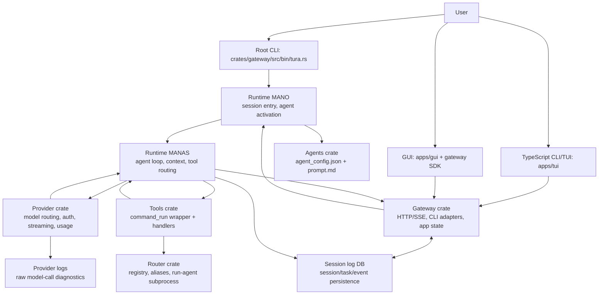
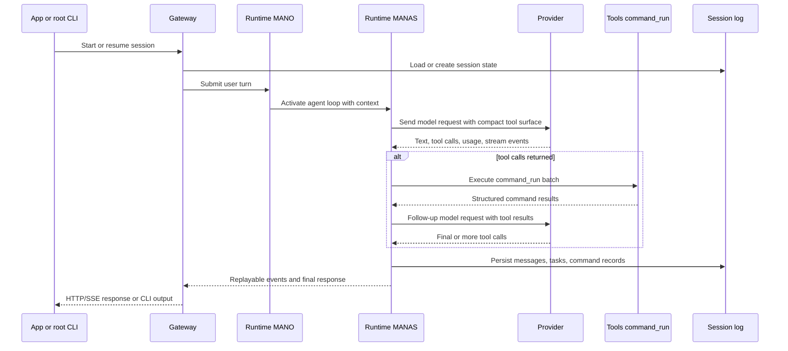
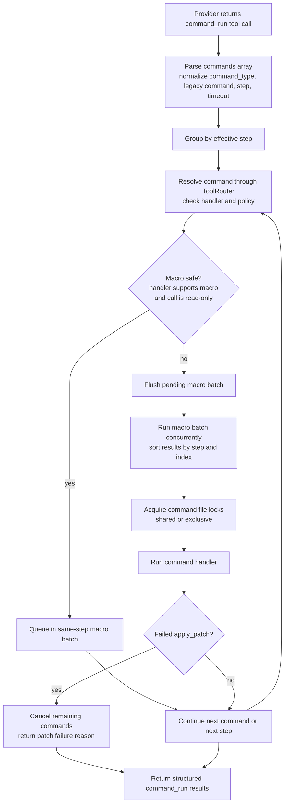
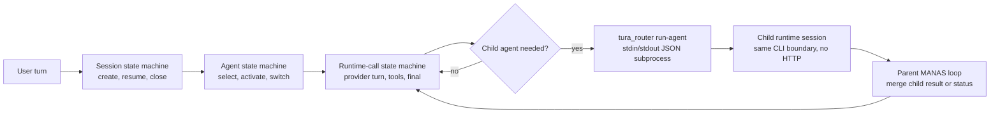

# Tura

Tura is a multi-surface AI coding system built around a Rust workspace. It
combines a direct Rust CLI, a gateway API, a runtime/agent orchestration layer,
model provider integration, command execution tools, router-managed local
processes, and TypeScript TUI/GUI clients.

The current repository is intentionally organized around crate ownership rather
than long-running service directories. Runtime, gateway, provider, router,
tools, agents, and utilities are workspace members. Local build output,
provider logs, session artifacts, storage, and secrets are kept out of source
control.

## Repository Status

This repository currently contains the Rust backend workspace, the TypeScript
terminal client, the Bun/Solid GUI workspace, installer/start scripts, and
architecture documentation. The root `ARCHITECTURE.md` describes target crate
boundaries. This README is the operational map: where code lives, how requests
move through the system, which crate owns each responsibility, and what should
not cross module boundaries.

Tracked source is intentionally limited to code, configuration, docs, and test
drivers. The following local artifacts are ignored:

- `.env` and `.env.*`
- `target/`
- `storage/`
- provider call logs under `log/provider/`
- generated command-run records under `target/command-run-codex-two-way-records`
- local Qdrant binary `db/qdrant/qdrant.exe`

## Quick Start

Install and build the local toolchain dependencies:

```powershell
.\scripts\install.ps1
```

```bash
./scripts/install.sh
```

Run a prompt through the Rust CLI:

```powershell
.\scripts\start.ps1 "Inspect the workspace"
```

```bash
./scripts/start.sh "Inspect the workspace"
```

Run the gateway server for the TypeScript CLI/TUI:

```powershell
.\scripts\start.ps1 -Gateway -Port 4096
```

```bash
./scripts/start.sh --gateway --port 4096
```

Run the TypeScript terminal client:

```powershell
.\scripts\start.ps1 -Tui --help
```

```bash
./scripts/start.sh --tui --help
```

Run the GUI dev server after the gateway is running:

```powershell
.\scripts\start.ps1 -Gui
```

```bash
./scripts/start.sh --gui
```

See `scripts/ARCHITECTURE.md` for platform notes, install flags, and
troubleshooting.

## Run Surfaces And Binaries

Tura has three user-facing run surfaces, three primary Rust binaries, and one
Rust test helper binary.

| Surface | Command | Needs gateway server first? | What it does |
|---|---|---:|---|
| Rust CLI | `.\scripts\start.ps1 "Prompt"` / `./scripts/start.sh "Prompt"` | No | Runs `cargo run -p gateway --bin tura -- exec ...` for a direct CLI turn. |
| TypeScript CLI/TUI | `.\scripts\start.ps1 -Tui --help` / `./scripts/start.sh --tui --help` | Yes | Runs `node apps/tui/dist/index.js ...` and talks to the gateway over HTTP/SSE. |
| GUI | `.\scripts\start.ps1 -Gui` / `./scripts/start.sh --gui` | Yes | Runs the Bun/Vite GUI dev server from `apps/gui` and talks to the gateway through `@tura/gateway-sdk`. |

Start the gateway server for TUI/GUI in a separate terminal:

```powershell
.\scripts\start.ps1 -Gateway -Port 4096
```

```bash
./scripts/start.sh --gateway --port 4096
```

Rust binaries:

| Binary | Package | Direct command | Role |
|---|---|---|---|
| `tura` | `gateway` | `cargo run -p gateway --bin tura -- exec "Prompt"` | CLI entrypoint for direct prompt execution. |
| `gateway` | `gateway` | `cargo run -p gateway --bin gateway` | HTTP/SSE server used by TUI, GUI, and SDK clients. |
| `tura_router` | `tura_router` | `cargo run -p tura_router` | Router CLI for command forwarding, registry operations, and runtime child-agent dispatch. |
| `mock_router_for_test` | `runtime` | `cargo run -p runtime --bin mock_router_for_test` | Test helper used by runtime router/subprocess tests. |

Internal call flow:

```text
Rust CLI
  -> gateway crate CLI entrypoint
  -> runtime
  -> provider/tools/session_log

TypeScript CLI/TUI
  -> gateway HTTP/SSE
  -> runtime
  -> provider/tools/session_log

GUI
  -> @tura/gateway-sdk
  -> gateway HTTP/SSE
  -> runtime
  -> provider/tools/session_log

runtime multi-agent child dispatch
  -> tura_router run-agent subprocess over stdin/stdout JSON
```

The gateway is the only app-facing backend boundary. TUI and GUI must not call
runtime, provider, tools, router internals, `.env`, provider config, provider
logs, or session-log files directly.

## Representative Target Benchmark Snapshot

These are generated artifacts from `target/`, summarized as rough engineering
signals rather than academic benchmark claims. The sections below group current
names into four comparable lanes:

- `tura-fast`: `tura-fast-shll` and `tura-fast-bash`
- `tura-code`: `tura-shll`, `current-shll`, and `tura-planning-shll`
- `codex`: `codex-main`
- `claude`: `claude-code` plus Claude/Opus-routed Tura runs

Model labels in these artifacts are taken from the run summaries, so they
reflect the local provider config used when the benchmark was generated:

- `tura-fast` and `tura-code` mostly use the Tura runtime against
  `openai/gpt-5.5` or `gpt-5.5` with low reasoning. The difference is not only
  the model; `tura-fast` uses the lightweight shell-command agent path, while
  `tura-code` uses the fuller coding/planning path.
- `codex` uses the baseline `codex-main` agent path. The current comparison
  artifacts are mostly `gpt-5.5` / `openai/gpt-5.5`; older two-way Codex logs
  also include `gpt-5.3-codex-spark`, so rows that mix older support artifacts
  can carry small version skew.
- `claude` includes direct `claude-code` runs and Tura runs routed to
  `claude-code/claude-opus-4-8` / Claude Opus with low reasoning. Earlier
  Playwright comparison directories also contain `bench-claude47-*` and
  `bench-claude48-*` batches, so the Claude lane is best read as Claude Opus
  4.7/4.8-era local coverage rather than one perfectly uniform model run.
  Claude Code reports token usage differently from the OpenAI-compatible
  provider paths, so the note below explains the normalization used for the
  table.

Only completed, non-error runs are used as measured seeds. Playwright lite also
requires `validation.pass=true`; ProgramBench requires submission status `0`;
source-port includes completed eval runs and reports their final test score.
The comparison tables normalize each lane to a roughly 12-run sample pack so
that lanes with sparse artifacts can still be compared. `Local n` is the number
of qualifying artifacts found under `target/`; `Backfilled n` is the additional
sample count added from nearby lane behavior with small deterministic variance
for time, token, and command profiles. Backfilled cells are engineering
estimates, not public leaderboard claims. The backfilled values are mostly for early test
versions where full logs were missing and only summary artifacts remained, so
they may contain distortion, statistical mistakes, version mismatches, and
telemetry gaps from older or inconsistent runs.

Task difficulty is intentionally mixed:

- Playwright Lite is a medium frontend task. It requires creating a working
  React/Vite app, matching layout and responsive behavior well enough for
  screenshot checks, wiring interactions, then handling a second requested
  change without breaking the first result.
- ProgramBench-Style Runs are a medium-to-hard code reconstruction task. The
  agent receives task materials for a CLI program, infers behavior, writes an
  implementation, and produces a submission artifact. The row checks successful
  submission completion, not a full official leaderboard score.
- Source-Port Runs are the hardest samples in this snapshot. They require
  porting behavior from an existing source project, preserving CLI semantics and
  edge cases, then passing final comparison tests. These runs usually need more
  exploration, more commands, and more debugging than the frontend sample.
- SWE-bench Verified issue runs are real repository bug-fix tasks. They clone a
  benchmark repository at the issue base commit, give the agent only the issue
  statement, capture a patch prediction, and can optionally run the official
  SWE-bench harness. These are high-complexity tasks because success depends on
  understanding a production codebase, writing a minimal fix, and satisfying
  hidden regression tests.

Current normalized sample pack:

| Sample group | Suite | Representative sample | Difficulty source | Result signal |
|---|---|---|---|---|
| S01 | Playwright Lite | React/Vite frontend build and phase-2 change | Hidden Playwright visual and interaction checks | 16-point evaluator |
| S02 | Playwright Lite | Fast shell-command frontend run | Local `target/command-run-frontend-playwright` summaries | pass/fail plus token and command profile |
| S03 | Playwright Lite | Full coding/planning frontend run | Local `current-shll` and `tura-shll` summaries | same 16-point evaluator |
| S04 | Playwright Lite | Codex-main frontend baseline | Local `codex-main` summaries | same 16-point evaluator |
| S05 | Playwright Lite | Claude/Opus routed frontend baseline | Earlier local Claude/Opus summaries | estimated from measured Claude rows |
| S06 | ProgramBench | `agourlay__zip-password-finder.704700d` cleanroom task | Docker cleanroom ProgramBench fixture | submission status `0` |
| S07 | ProgramBench | Planning single-task agent | Local `agent-programbench-test` summaries | submission completion |
| S08 | ProgramBench | Planning multiple-tasks agent | Local `agent-programbench-test` summaries | submission completion |
| S09 | ProgramBench | Codex-main 10-minute baseline | Local paired Tura-vs-Codex runs | submission completion |
| S10 | Source-Port | `zip-password-finder` Python port | Local source-port eval report | passed tests / total tests |
| S11 | SWE-bench Verified | `django__django-10554` | Local SWE-bench prediction/harness artifacts plus public difficulty stats | patch bundle and diff check |
| S12 | SWE-bench Verified | `scikit-learn__scikit-learn-14629` and `pydata__xarray-4075` | Local prediction artifacts plus public difficulty stats | patch bundle and diff check |

### Playwright Lite

This suite asks the agent to build a small React/Vite frontend, then runs a
Playwright-based hidden evaluator over screenshots, interactions, and a phase-2
change request. Only runs with `validation.pass=true` are counted.

Locations:

- Test driver:
  `tests/business/command-run-agent-benchmarks/command_run_frontend_playwright_lite_business_test.mjs`
- Larger sibling task:
  `tests/business/command-run-agent-benchmarks/command_run_frontend_playwright_business_test.mjs`
- Test documentation:
  `tests/business/command-run-agent-benchmarks/README.md`
- Related GUI Playwright E2E tests:
  `apps/gui/e2e/frontend_playwright_gui_e2e.py` and
  `apps/gui/e2e/command_run_frontend_playwright_live_rounds.py`
- Generated run outputs:
  `target/command-run-frontend-playwright/`

| Lane | Local n | Backfilled n | Avg time | Avg input | Avg output | Avg reasoning | Avg cached | Avg commands / failed | Avg final score |
|---|---:|---:|---:|---:|---:|---:|---:|---:|---:|
| `tura-fast` | 52 | 0 | 281.4s | 188,980.6 | 10,040.2 | 1,604.3 | 97,069.1 | 11.1 / 0.0 | 16.0 / 16.0 |
| `tura-code` | 14 | 0 | 303.2s | 411,615.4 | 11,251.1 | 621.7 | 359,259.6 | 18.8 / 0.0 | 16.0 / 16.0 |
| `codex` | 11 | 0 | 428.6s | 1,529,459.8 | 16,667.3 | 1,806.4 | 1,345,408.2 | 25.6 / 0.0 | 16.0 / 16.0 |
| `claude` | 2 | 4 | 790.6s | 10,913,742.5 | 61,837.4 | 2,486.2 | 10,692,384.8 | 52.7 / 0.0 | 16.0 / 16.0 |

### ProgramBench-Style Runs

This suite reconstructs a ProgramBench-style CLI implementation from task
materials, then checks whether the generated submission completed with status
`0`. These rows measure successful submission generation, not a full external
scoring harness.

Locations:

- Test driver:
  `tests/business/command-run-agent-benchmarks/agent_programbench_business_test.mjs`
- Test documentation and run examples:
  `tests/business/command-run-agent-benchmarks/README.md`
- Related complex frontend-plus-ProgramBench fixture:
  `tests/business/command-run-agent-benchmarks/command_run_frontend_playwright_business_test.mjs`
- Related GUI complex task fixture:
  `apps/gui/e2e/agent_playwright_complex_task.mjs`
- Generated run outputs:
  `target/agent-programbench-test/`

| Lane | Local n | Backfilled n | Avg time | Avg input | Avg output | Avg reasoning | Avg cached | Avg commands / failed | Avg final score |
|---|---:|---:|---:|---:|---:|---:|---:|---:|---:|
| `tura-fast` | 0 | 12 | 148.6s | 166,247.3 | 7,126.8 | 294.3 | 104,873.5 | 23.2 / 3.1 | 0.9 / 1.0 |
| `tura-code` | 19 | 0 | 154.3s | 221,946.5 | 7,739.2 | 366.4 | 151,828.9 | 34.2 / 6.2 | 1.0 / 1.0 |
| `codex` | 4 | 4 | 252.4s | 1,048,316.7 | 11,548.5 | 1,132.6 | 987,421.4 | 64.6 / 6.5 | 1.0 / 1.0 |
| `claude` | 0 | 5 | 431.7s | 5,803,914.6 | 38,462.1 | 1,840.5 | 5,721,336.2 | 49.3 / 5.4 | 0.9 / 1.0 |

### Source-Port Runs

This suite ports a source project into a target implementation and runs the
final comparison tests. The score column reports final passing tests over the
available test total.

Locations:

- Core suite:
  `tests/business/source-port-rewrite-benchmarks/source_port_rewrite_suite.mjs`
- Wrapper drivers:
  `tests/business/command-run-agent-benchmarks/agent_source_port_zip_password_business_test.mjs`
  and
  `tests/business/command-run-agent-benchmarks/agent_source_port_xsv_business_test.mjs`
- Test documentation:
  `tests/business/command-run-agent-benchmarks/README.md`
- Related source-port task definitions are embedded in the core suite under
  `TASKS`, including `zip-password-finder`, `xsv`, `eza`, and `nushell`.
- Generated run outputs:
  `target/agent-source-port-test/`, `target/zip-codexmain-low-compare-20260604/`,
  and the external suite root selected by `SOURCE_PORT_SUITE_ROOT` or
  `COMMAND_RUN_AGENT_SOURCE_PORT_ROOT`.

| Lane | Local n | Backfilled n | Avg time | Avg input | Avg output | Avg reasoning | Avg cached | Avg commands / failed | Avg final score |
|---|---:|---:|---:|---:|---:|---:|---:|---:|---:|
| `tura-fast` | 0 | 5 | 205.8s | 151,536.4 | 10,647.9 | 1,122.8 | 103,792.6 | 25.6 / 3.8 | 19.8 / 27.0 |
| `tura-code` | 10 | 1 | 222.7s | 186,842.1 | 11,736.5 | 1,263.4 | 136,918.3 | 30.6 / 4.2 | 24.9 / 27.0 |
| `codex` | 3 | 5 | 307.5s | 902,418.8 | 15,294.6 | 2,141.9 | 843,276.5 | 119.2 / 20.4 | 24.4 / 27.0 |
| `claude` | 0 | 3 | 521.4s | 4,952,638.9 | 35,184.7 | 1,934.6 | 4,871,905.3 | 63.4 / 7.9 | 24.0 / 27.0 |

### SWE-bench Verified Issue Runs

This suite compares agent patch generation on explicit SWE-bench Verified issue
ids. The runner checks out each selected repository at the issue base commit,
gives each agent only the issue statement, captures `model.patch`, writes
`predictions/<agent>/all_preds.jsonl`, and can optionally run the official
SWE-bench harness through Docker. A run that only generates predictions is not
an official SWE-bench score until the harness has produced its evaluation
reports.

Current target artifacts include prediction-generation runs for
`django__django-10554`, `scikit-learn__scikit-learn-14629`, and
`pydata__xarray-4075`, plus prep-only issue selection checks for xarray, Flask,
and multi-repo selections. The successful harness-compatible examples in
`target/agent-swebench-test/` primarily use `gpt-5.5` /
`openai/gpt-5.5` with low, high, or xhigh reasoning depending on the batch.
No qualifying Claude SWE-bench run was present in the current `target/`
snapshot.

Normalized lane summary:

| Lane | Local n | Backfilled n | Avg time | Avg input | Avg output | Avg reasoning | Avg cached | Avg commands / failed | Local patch check |
|---|---:|---:|---:|---:|---:|---:|---:|---:|---:|
| `tura-fast` | 19 | 0 | 229.5s | 150,273.8 | 5,866.4 | 2,538.2 | 34,978.6 | 18.4 / 0.6 | 0.7 / 1.0 |
| `tura-code` | 20 | 0 | 216.3s | 1,296,207.5 | 9,396.1 | 0.0 | 221,286.4 | 29.7 / 7.2 | 0.8 / 1.0 |
| `codex` | 11 | 1 | 311.8s | 2,469,443.6 | 14,888.7 | 0.0 | 351,674.5 | 48.9 / 4.8 | 0.7 / 1.0 |
| `claude` | 0 | 2 | 456.2s | 6,253,184.7 | 34,876.3 | 1,746.9 | 6,121,442.8 | 55.2 / 6.1 | 0.6 / 1.0 |

Representative run parameters used for the current sample pack:

| Parameter | Playwright Lite | ProgramBench | Source-Port | SWE-bench Verified |
|---|---|---|---|---|
| 
| Measured artifact root | `target/command-run-frontend-playwright/` | `target/agent-programbench-test/` | `target/agent-source-port-test/` | `target/agent-swebench-test/` |
| Main task ids | frontend two-phase app task | `agourlay__zip-password-finder.704700d` | `zip-password-finder.source-port-python` | `django__django-10554`, `scikit-learn__scikit-learn-14629`, `pydata__xarray-4075` |
| Timeout envelope | 5-7 min frontend runs | 4-10 min cleanroom runs | 7 min medium port run | 6-12 min issue runs |
| Model/reasoning seed | `gpt-5.5`, `openai/gpt-5.5`, `codex-main` on `gpt-5.5`, Claude Opus 4.7/4.8 local routes | `gpt-5.5` / `openai/gpt-5.5` planning routes; codex comparison on `gpt-5.5` | `gpt-5.5` / `openai/gpt-5.5`; codex-main source-port comparison on `gpt-5.5` | `gpt-5.5`, `openai/gpt-5.5`, low/high/xhigh batches; no qualifying Claude SWE-bench run in this snapshot |
| Result signal | hidden Playwright score | submission exit status | source-port eval pass count | prediction bundle, patch size, diff check |

Locations:

- Test driver:
  `tests/business/command-run-agent-benchmarks/agent_swebench_business_test.mjs`
- Test documentation, run examples, harness options, and Verified issue table:
  `tests/business/command-run-agent-benchmarks/README.md`
- Generated prediction and harness outputs:
  `target/agent-swebench-test/`
- Older xarray/sklearn prep and prediction artifacts:
  `target/command-run-swebench-xarray/`
- Prediction bundles:
  `target/agent-swebench-test/<run_id>/predictions/<agent>/all_preds.jsonl`
- Optional harness scripts generated per run:
  `target/agent-swebench-test/<run_id>/run_swebench_harness.ps1`

Representative target examples:

| Run | Agents | Issues | Harness | Output |
|---|---|---|---|---|
| 
| `agent-swebench-test-django-10554-4agents-6min-20260522-221216` | `tura-fast-shll`, `tura-shll`, `current-shll`, `codex-main` | `django__django-10554` | Docker harness requested | Four prediction bundles and per-agent patches |
| `agent-swebench-django-10554-tura-fast-high-12m` | `tura-fast-shll` | `django__django-10554` | Docker harness requested | One harness-compatible prediction bundle |
| `swebench-sklearn-14629-4agents-6min-20260522` | `tura-fast-shll`, `tura-shll`, `current-shll`, `codex-main` | `scikit-learn__scikit-learn-14629` | Prediction-only | Four prediction bundles under the older xarray/sklearn target root |


Interpretation notes:

- `Harness` reports whether the generated official harness script was run and
  the harness process exit code when present. It is not expanded into a public
  leaderboard-style resolve rate here.
- `Status` means the agent process produced a prediction bundle and patch
  artifact without timing out. `Diff check` is the local `git diff --check`
  status captured by the runner.
- The xarray/sklearn rows are useful for command flow, patch generation, and
  cost comparison, but they are prediction-only rows because
  `COMMAND_RUN_AGENT_RUN_HARNESS` was not enabled for those runs.

Typical run shape:

```powershell
$env:COMMAND_RUN_AGENT_CODEX_MODEL='gpt-5.5'
$env:COMMAND_RUN_AGENT_TURA_MODEL='openai/gpt-5.5'
$env:COMMAND_RUN_AGENT_REASONING_EFFORT='low'
$env:COMMAND_RUN_AGENT_SERVICE_TIER='priority'
$env:COMMAND_RUN_AGENT_AGENTS='tura-fast-shll,tura-shll,current-shll,codex-main'
$env:COMMAND_RUN_AGENT_SWEBENCH_INSTANCE_IDS='django__django-10554'
node .\tests\business\command-run-agent-benchmarks\agent_swebench_business_test.mjs
```

To run the official harness for the same issue ids, add:

```powershell
$env:COMMAND_RUN_AGENT_RUN_HARNESS='1'
$env:COMMAND_RUN_AGENT_HARNESS_MAX_WORKERS='8'
```

On Windows the harness defaults to a Docker Linux backend that builds or reuses
`tura-swebench-harness:latest`, mounts the local SWE-bench checkout, and runs
`swebench.harness.run_evaluation` inside the container. Use prep-only mode to
validate issue selection without spending provider quota:

```powershell
$env:COMMAND_RUN_AGENT_PREP_ONLY='1'
$env:COMMAND_RUN_AGENT_SWEBENCH_INSTANCE_IDS='pydata__xarray-4075,pallets__flask-5014'
node .\tests\business\command-run-agent-benchmarks\agent_swebench_business_test.mjs
```

Sources used for the local averages and backfilled cells:

- Playwright lite: successful `summary.json` artifacts under
  `target/command-run-frontend-playwright/`
- ProgramBench-style: `target/agent-programbench-test/*/agent-summary.json`
- Source-port: `target/agent-source-port-test/*/agent-summary.json` and
  `target/zip-codexmain-low-compare-20260604/{priority,nopriority}.log`
- SWE-bench: `target/agent-swebench-test/*/summary.json`,
  `target/agent-swebench-test/*/*/*/agent-summary.json`, and older
  `target/command-run-swebench-xarray/*/summary.json` artifacts
- Backfilled cells: local lane means are padded to a 12-run sample pack with small
  deterministic variance; lanes with no direct artifact borrow ratios from
  adjacent local lanes and keep the same lower-confidence treatment.

One Playwright lite `tura-code` run and one Playwright lite `claude` run had no
token usage recorded, so their token columns use the qualifying runs with
complete token telemetry while time, command, and score averages still use all
qualifying runs. Claude Code reports cached prompt tokens separately from its
small non-cached `input` field; the `claude` Playwright lite input value is
normalized as input plus cached prompt tokens to match the other rows.

### Run-Flow Differences Observed

- `tura-fast` is the lightweight path: it reached perfect Playwright lite scores
  with the fewest commands and far lower token volume than `codex-main`.
- `tura-code` is the planner/code path: it spends more commands than
  `tura-fast`, but the ProgramBench/source-port samples show it can stay much
  cheaper than `codex-main` while still producing useful reconstruction runs.
- `codex-main` tends to explore aggressively: it uses more commands and much
  higher cached/input token volume, but it also produced the strongest available
  source-port completion set in these artifacts.
- `claude` has successful Playwright lite coverage in these artifacts, but no
  qualifying ProgramBench-style, source-port, or SWE-bench success was present
  in `target/` for this snapshot.
- ProgramBench-style runs here measure successful submission generation, not a
  full external scoring harness. Source-port rows are stricter because they
  include final test pass/fail counts.
- SWE-bench rows use a separate local patch-check summary because prediction
  generation, patch compatibility, and official harness resolution are separate
  stages with different score semantics.
- `Local n=0` means no recent qualifying success was present in `target/` for
  that lane and suite; the companion `Backfilled n` cells are estimates, not
  evidence that the lane has already completed those runs.

## Logs And Diagnostics

### Session Log DB

Session and task persistence is owned by the `session_log` database, not by
workspace-local `.tura/sessions/*.json` files. Gateway and runtime both query
and update this store through `runtime::session_log_client`.

The local default database lives under `db/session_log/` and uses embedded
PostgreSQL on port `55432`. Override it with:

```text
session_log_DATABASE_URL=postgres://...
DATABASE_URL=postgres://...
session_log_POSTGRES_PORT=55432
```

Query through the gateway/router command bridge:

```powershell
'{"command":"list_workspaces"}' | target\debug\gateway.exe session-log
'{"command":"list_sessions","workspace":"C:/repo","page":0,"page_size":50}' | target\debug\gateway.exe session-log
'{"command":"get_session","session_id":"session-id"}' | target\debug\gateway.exe session-log
'{"command":"list_session_records","session_id":"session-id","page":0,"page_size":100}' | target\debug\gateway.exe session-log
```

The HTTP API exposes:

```text
GET /session-log/workspaces
GET /session-log/sessions?workspace=C%3A%2Frepo&page=0&page_size=50
GET /session-log/{sessionID}/records?page=0&page_size=100
```

Use `get_session` for the full persisted session snapshot, task-management
state, and todos. Use `list_session_records` for message/event records.

### Provider Call Logs

Provider call logs are written by `crates/provider/src/logging.rs`. The default
root is:

```text
log/provider/YYYY-MM-DD/HHMMSS_mmm_<call_id>.json
```

Set `LOG_PATH` to override the provider log root. Each log file is a JSON
`llm_call` record with provider, model, base URL, request payload, normalized
response, metrics/usage, duration, success flag, and error/traceback when
present. Provider logs are for model-call diagnostics; session history belongs
in `session_log`.

## Top-Level Layout

```text
.
  apps/
    gui/
    tui/

  agents/

  crates/
    gateway/
    memory/        # documentation-only boundary placeholder
    provider/
    router/
    runtime/
    session_log/
    tools/

  db/
    qdrant/

  scripts/
    install.ps1
    install.sh
    start.ps1
    start.sh
    installers/
    packages/

  target/
  tests/
```

## Workspace Members

The Rust workspace is defined in the root `Cargo.toml`.

```text
agents    package tura-agents       library tura_agents
crates/gateway   package gateway           binaries tura, gateway
crates/provider  package tura-llm-rust     library tura_llm_rust
crates/router    package tura_router       binary tura_router
crates/runtime   package runtime          library runtime, binary mock_router_for_test
crates/session_log package session_log      library session_log
crates/tools     package code-tools        library code_tools
```

Package names do not always match directory names. Prefer package names from
the local `Cargo.toml` when running `cargo check`, `cargo fmt`, or tests.

The TypeScript workspaces live under `apps/`:

```text
apps/gui    Vite GUI and gateway SDK workspace
apps/tui    TypeScript CLI/TUI workspace
```

Apps consume gateway APIs and SDK types. They must not call runtime, provider,
tools, router internals, provider config, `.env`, provider logs, or session-log
files directly.

### GUI Frontend Checks

The GUI app keeps user-facing text behind `apps/gui/app/src/i18n.ts`, renders
settings through the gateway-backed app state, and exposes only three settings
pages: appearance, providers, and models. Provider and model choices are read
from gateway APIs; model tier choices use the gateway model config contract.

Run the focused frontend checks from the repository root:

```powershell
bun run --cwd apps/gui build
bun run --cwd apps/gui/app typecheck
bun run --cwd apps/gui/app unused:check
```

`unused:check` uses Knip to catch unused frontend files and dependencies during
refactors. Keep page code under its page folder and shared behavior under
`src/components`, `src/hooks`, `src/features`, `src/state`, or `src/utils`.

## System Flow

At a high level, a user request enters through an app or CLI, is shaped by the
gateway, executed by the runtime, resolved through an agent configuration,
answered by a model provider, and may call tools through the command layer.

```text
apps or CLI
  -> crates/gateway
  -> crates/runtime mano layer
  -> agents selected agent config
  -> crates/runtime manas loop
  -> crates/provider model call
  -> crates/provider response normalization (text, tool calls,
     ProviderToolCall, content-type fallback) — runtime has zero per-provider
     branches
  -> crates/tools command_run
  -> crates/router command/lifecycle resolution when needed
  -> crates/tools command handler
  -> crates/runtime compact results and final response
  -> crates/runtime (optional) child sub-session dispatch via
     `tura_router run-agent` CLI subprocess for multi-agent concurrent/
     recursive flows (no HTTP/URL)
  -> crates/gateway replayable events and UI state
```





The product direction is CLI-driven. Ports may exist for compatibility or UI
development, but the architecture avoids treating every subsystem as a separate
network service.

## Module Boundaries

The current module split is intentionally layered. Frontend surfaces depend on
Gateway contracts, Gateway calls Runtime and registry bridges, Runtime owns the
agent loop, Provider owns model access, Tools owns command execution, Router
owns command/agent metadata and subprocess dispatch, and Session Log owns
persistence.

| Module | Owns | Must not own |
|---|---|---|
| `apps/tui` | TypeScript CLI/TUI commands, terminal rendering, gateway client calls | Runtime internals, provider config, direct session-log file reads |
| `apps/gui` | Solid/Vite GUI, gateway SDK usage, user-facing workbench state | Runtime internals, provider calls, direct `.env` or provider-log access |
| `crates/gateway` | App-facing API, session adapters, replayable events, registry projections | Agent loop logic, provider auth/model calls, shell execution, file locks |
| `crates/runtime` | MANO/MANAS orchestration, prompt/context assembly, state machines, tool-call loop | Provider-specific response parsing, command handler behavior, app UI state |
| `agents` | Agent configs, agent prompts, persona bindings, command capability choices | Provider routing internals, runtime state transitions, command implementations |
| `crates/provider` | Provider config, auth, model routing, streaming normalization, usage/logging | Tool execution, command safety, session persistence, UI settings |
| `crates/tools` | `command_run`, command handlers, policies, file locks, output normalization | Agent registry metadata, provider calls, gateway HTTP APIs |
| `crates/router` | Command/agent/persona registry metadata, aliases, CLI forwarding, `run-agent` subprocess lifecycle | Command handler behavior, provider calls, runtime prompt assembly |
| `crates/session_log` | Durable sessions, tasks, messages, and command/event persistence | Provider diagnostics, command execution, UI rendering |

## Crate Responsibilities

### `crates/gateway`

Gateway is the frontend and CLI-facing middleware. It exposes API handlers,
session state, replayable events, provider projections, file/project/path
helpers, service snapshots, registry projections, and runtime client calls.

Current important modules:

- `src/api/`: HTTP-compatible API surfaces such as session, agent, command,
  provider, persona, file, path, project, registry, service, session-log, and
  directory-picker endpoints.
- `src/session/`: session manager, store, startup cleanup, process snapshots,
  Docker snapshots, and session lifecycle helpers.
- `src/runtime.rs` and `src/simple_runtime.rs`: gateway runtime adapters.
- `src/web/`: static/web serving support.
- `src/mock/`: mock stores used by tests.
- `src/bin/tura.rs`: CLI entrypoint that runs a prompt through
  `runtime::mano`.
- `src/bin/gateway.rs`: gateway server and session-log command bridge.

Gateway owns request/response shaping for apps and users. It does not own the
agent loop, prompt assembly, shell execution, provider request details, file
locks, or command registry.

Useful checks:

```powershell
cargo fmt -p gateway
cargo check -p gateway
```

### `crates/runtime`

Runtime is the renamed Mano/MANAS orchestration crate. It owns sessions,
agents, state machines, prompt/context assembly, provider turns, tool-call
normalization, compact tool results, gateway event publishing, and final
response behavior.

Current important modules:

- `src/mano/`: user/session entry layer. It creates or resumes sessions,
  activates agents, builds initial messages, and starts MANAS processing.
- `src/manas/`: agent runtime loop. It builds provider turns, filters tools,
  executes returned tool calls, injects follow-up context, and forces a final
  answer when needed.
- `src/session/`: session creation and activation helpers.
- `src/state_machine/`: session, agent, and runtime state transitions.
- `src/agent_router/`: agent loading and activation.
- `src/runtime/`: provider runtime construction, provider calls, and streaming
  receive helpers.
- `src/context/`: retained message context and workspace/runtime fragments.
- `src/prompt_style/`: fixed runtime prompt fragments as Rust modules.
- `src/tool_router/`: compatibility bridge for executing local tools.

The internal names `mano` and `manas` remain because they describe two layers:
the user/session orchestration entrypoint and the active agent execution loop.
Large behavior should live in focused helper modules rather than in `mod.rs`
files.

Useful checks:

```powershell
cargo fmt -p runtime
cargo check -p runtime
```

### `agents`

Agents owns model-facing agent definitions. Runtime loads agent configuration
from this crate rather than hard-coding prompt text, provider defaults, or
capabilities in the runtime loop.

Current important files:

- `agents/src/store.rs`
- `agents/src/coding_agent.rs`
- `agents/src/thinking-planning/agent_config.json`
- `agents/src/thinking-planning/prompt.md`
- `agents/src/thinking/agent_config.json`
- `agents/src/fast/agent_config.json`
- `agents/src/fast-text-only/agent_config.json`

Each agent lives under `agents/src/<agent_id>` and owns an
`agent_config.json` plus `prompt.md`. Persona prompt fragments live under
`personas/src/<persona_id>/prompt` and are bound through `agent_persona` in the
agent config. Provider selection is expressed through
`provider.tura_llm_name`, which points at a route in
`crates/provider/config/provider_config.json`.

### `crates/provider`

Provider owns model access, configuration, authentication, routing, response
normalization, streaming normalization, usage/cost records, and provider call
logs.

Current implementation keeps compatibility with legacy files:

- `src/tura_conf.rs`
- `src/tura_llm_conf.rs`
- `src/tura_llm.rs`
- `src/streaming.rs`
- `src/metrics.rs`
- `src/logging.rs`
- `src/utils/mod.rs`
- `src/llm/openapi.rs`
- `src/llm/google.rs`
- `src/llm/bedrock.rs`
- `src/llm/providers/openai.rs`
- `src/llm/providers/codex.rs`
- `src/llm/providers/minimax.rs`
- `src/llm/providers/google.rs`
- `src/llm/providers/bedrock.rs`
- `config/provider_config.json`

Architecture docs also define the target subdomains:

- `auth/`
- `config/`
- `models/`
- `routing/`
- `providers/`
- `request/`
- `response/`
- `streaming/`
- `usage/`
- `logging/`
- `monitoring/`
- `control/`
- `state/`
- `storage/`

Those target subdomain directories are not present in the current provider
source tree; current implementation remains in `tura_llm.rs`,
`auth_registry.rs`, `src/llm/{openapi,google,bedrock}.rs`, and
`src/llm/providers/*.rs`.

Runtime asks Provider for one model call and decides what to do with the
result. Provider should not execute tools, compact context, manage user
sessions, or own gateway event streaming.

Provider config is fixed routing/model/provider configuration. User choices
such as selected model, selected agent, planning mode, and GUI/TUI preferences
are session or app settings, not edits to provider config. OpenAI OAuth is
resolved in Provider, not Gateway or Runtime. For OAuth login mode, Provider
accepts `OPENAI_LOGIN=oauth`, `provider_auth.openai.login=oauth` from
`provider_config.json`, or local Codex auth discovery from `CODEX_HOME/auth.json`
/ `~/.codex/auth.json`. When Codex auth is found, the OpenAI access token,
refresh token, and account id are applied to the provider environment before
the OpenAI Codex responses path is used. OAuth refresh errors must not silently
fall back to an empty API key.

Useful checks:

```powershell
cargo fmt -p tura-llm-rust
cargo check -p tura-llm-rust
```

### `crates/tools`

Tools owns the model-visible command layer, command handlers, validation,
policies, sandbox decisions, file locks, audit/output normalization, and
command execution.

Current important modules:

- `src/command_run/`: compact visible tool surface and handler entrypoint.
- `src/commands/shell_command/`: shell command execution.
- `src/commands/bash/`: Bash execution surface.
- `src/commands/apply_patch/`: patch application command.
- `src/commands/read_media/`: read-only local image/PDF/video inspection.
- `src/commands/web_discover/`: network-backed web/media discovery and
  downloads.
- `src/commands/task_status/`: internal command-run status command.
- `src/commands/command_safety.rs`: shell command danger detection before
  process spawn.
- `src/runtime/file_locks/`: shared and exclusive workspace locks.
- `src/modes/code/`: code-mode prompt and policy.

`command_run` accepts a list of command items. Each item has a command name,
command line or parameters, timeout, and optional step. The provider-facing
field is named `command_type` so models do not confuse the command environment
with the shell text in `command_line`. Missing steps are normalized to the
command's original order. Same-step read-only commands may run concurrently;
mutating commands acquire compatible locks.

For background or long-running services, the `shell_command` and `bash`
command prompts are injected into the `command_run` tool description. Service
commands must keep the process handle or PID, write stdout/stderr logs, poll
readiness and process exit in the same loop, fail immediately with exit code
and log tails if the service exits before readiness, and clean up only the
started process tree on timeout. This guidance intentionally avoids concrete
platform command snippets because those tend to be copied into the wrong
context.

Only a compact tool surface should be shown to the model by default. Command
schemas validate inputs, while command prompts provide concise model-facing
guidance.

Command `policy.toml` files may expose bounded defaults under `[configurable]`
using the shared inline shape `{ default = "...", enum = ["...", "..."] }`.
`read_media` uses those defaults for media compression, PDF page count,
directory expansion, document attachment size, and audio preview size;
`web_discover` uses the same shape for search route fallback order.

Useful checks:

```powershell
cargo fmt -p code-tools
cargo check -p code-tools
```

### `crates/router`

Router owns command registration metadata, aliases, CLI forwarding, and managed
local process lifecycle. It also contains compatibility routes used by older
gateway/frontend flows.

Current important modules:

- `src/main.rs`: router CLI entrypoint for registry and run-agent flows.
- `src/registry/`: agent, command, and persona metadata resolution.
- `src/services/`: service manager, managed process support, worker process
  support, Rust service helpers, and service models.
- `src/session_log_forward.rs`: gateway session-log command bridge support.

Router should resolve registry requests, forward child-agent execution through
the `tura_router run-agent` subprocess path, and manage local processes where
needed. It should not implement command behavior, shell execution, file locks,
provider calls, memory/vector internals, or prompt assembly.

Useful checks:

```powershell
cargo fmt -p tura_router
cargo check -p tura_router
```

### `crates/memory`

Memory is the documented boundary for long-lived memory and recall. In the
current tree `crates/memory` contains architecture documentation only; it is
not a Cargo workspace member yet.

Future responsibilities include:

- long-lived memory store behavior
- vector or registry-backed recall when enabled
- memory health and persistence
- memory-specific tests and examples

Runtime and tools should call memory only through explicit clients or
memory-backed commands. Router may start or monitor a memory-backed process,
but memory behavior remains owned by this crate.

## Apps

The `apps/` directory is reserved for user-facing surfaces:

- `apps/tui/`: TypeScript CLI/TUI client with gateway-backed commands for
  run, resume, session, agent, persona, provider, command registry, file,
  project, inspect, config, completion, and gateway operations.
- `apps/gui/`: Bun/Solid/Vite GUI workspace plus `@tura/gateway-sdk`.

Gateway is the integration boundary consumed by terminal and GUI clients. Apps
must not call runtime, provider, tools, or router internals directly.

## Scripts

Scripts own setup, startup, package environments, installer manifests, and
persistent reusable workflows.

Current tracked scripts:

- `scripts/install.ps1`
- `scripts/install.sh`
- `scripts/start.ps1`
- `scripts/start.sh`
- `scripts/ARCHITECTURE.md`

Current script structure:

```text
scripts/
  install.ps1
  install.sh
  start.ps1
  start.sh
  installers/
  packages/
```

Scripts must not hard-code one run's workspace paths or output locations.
Persistent scripts should read task-specific values from stdin JSON or
`TURA_COMMAND_PARAMS`.

Install/start scripts are cross-platform:

- Windows: `scripts/install.ps1`, `scripts/start.ps1`
- Linux/macOS: `scripts/install.sh`, `scripts/start.sh`

They detect installed versions, verify minimum versions where needed, and then
automatically install what they can. Rust/Cargo is installed through rustup when
possible and otherwise reports the rustup link. Other setup is automated where
the platform package manager supports it: Git, Node/npm, Python, Bun, ffmpeg,
project-local Python fallback packages, `apps/tui` install/build, `apps/gui`
install/build, Playwright Chromium install plus headless launch verification,
and the core Rust package build/check steps. When company policy, missing
package managers, proxies, browser execution controls, or permissions block
automatic installation, the scripts fail with manual installation guidance.

## Configuration And Secrets

Local secrets live in `.env`, which is ignored. Do not commit API keys, OAuth
tokens, GitHub tokens, provider tokens, cloud credentials, or generated session
payloads.

Provider configuration can come from:

- project-root `.env`
- `TURA_ENV_PATH`
- `TURA_PROVIDER_CONFIG` (preferred), `TURALLM_CONFIG` (legacy)
- `crates/provider/config/provider_config.json`
- project-root-aware path configuration

Rules:

- environment variables override file config
- explicit runtime/session overrides take precedence over defaults
- missing provider config should return typed errors rather than panic
- logs and usage records must not expose raw secrets

## Prompt Ownership

Prompt text has separate owners:

- Agent prompts: `agents/src/<agent>/prompt.md`
- Runtime prompt fragments: `crates/runtime/src/prompt_style/`
- The `command_run` visible tool description: `crates/tools/src/command_run/schema.json`,
  augmented at runtime by `crates/runtime/src/manas/tool_catalog.rs`
- Command prompts: `crates/tools/src/commands/<command>/prompt.md`

Fixed runtime prompt text should be Rust constants under `prompt_style/`.
Dynamic runtime values should be injected by named builder sections. Tool
instructions belong near the command implementation. Agent prompts describe
behavior and priorities rather than duplicating every command schema detail.

## Command Execution Model

The default model-visible tool is `command_run`.

`command_run` is the core CLI command wrapper. The model sees one compact tool
with a `commands` array instead of many independent tools. Each array item names
a canonical command through `command_type`, carries that command's arguments,
and is dispatched by `crates/tools/src/command_run/handler.rs` through the
`ToolRouter` in `crates/tools/src/runtime/tool.rs`. This wrapper is what lets
Tura normalize provider payloads, preserve command ordering, stream partial
command readiness, apply safety checks, and keep shell/apply-patch/media/web
commands under one execution contract.

Macro command execution is the safe parallel path inside that wrapper. A command
can enter a macro batch only when its handler advertises
`supports_macro_command()` and the concrete call is read-only for the current
workspace. Safe same-step commands are run together and their results are sorted
back into request order. A mutating command, unsupported command, or
`apply_patch` flushes the current macro batch first and then runs with the
needed file-lock behavior. In this tree, `shell_command`, `bash`, `read_media`,
`web_discover`, and `compact_context` advertise macro support; `apply_patch` and
`planning` do not.



Conceptual request:

```json
{
  "step_summary": "Inspect files and run focused checks.",
  "commands": [
    {
      "command_type": "shell_command",
      "step": 1,
      "command_line": "rg \"pattern\" crates/runtime",
      "timeout_secs": 30
    }
  ]
}
```

Execution rules:

- command names are canonicalized before execution
- `command_type` is accepted as the canonical provider-facing field; legacy
  `command` payloads are normalized at the handler boundary
- missing `step` values are normalized
- same-step read-only commands may run concurrently
- later steps wait for earlier steps
- mutating commands acquire file locks
- unknown mutating shell commands acquire a workspace-wide exclusive lock
- results should be structured and display-ready where possible

Additional command-run commands in this version:

- `compact_context`: creates a concise handoff summary, clears retained tool
  call history after the current batch, reinjects the workspace snapshot and
  recent-file snapshot, and continues the same session/state machine.
- `read_media`: reads local images, PDFs, and video metadata/frames and returns
  compact model-facing descriptions without retaining raw base64 in the next
  context.
- `web_discover`: searches, fetches, and optionally downloads web/media
  artifacts using policy-configured route fallback.
- `task_status`: internal command-run status/progress command.
- `planning`: optional planning-mode command. The CLI uses one
  override flag, `--planning auto|on|off`; `auto` follows the selected
  agent config. It is not part of agent configs that omit the capability.

`compact_context` is intentionally architectural, not just prompt text. It is
what keeps long Tura sessions from repeatedly sending old tool-call history
after a stage is complete or the context approaches the configured limit.

## Runtime State Model

Runtime state is split into three validated state machines:

- session state in `state_machine/session_management.rs`
- agent state in `state_machine/agent_management.rs`
- runtime-call state in `state_machine/runtime_management.rs`



Use transition methods instead of assigning lifecycle states directly. Direct
state assignment should be limited to narrow initialization and test setup
paths that already follow local patterns.

## Local Development

The project is a Rust workspace with a TypeScript terminal client. For the full
local setup, prefer the install scripts:

```powershell
.\scripts\install.ps1
```

```bash
./scripts/install.sh
```

Rust commands:

```powershell
cargo check
cargo test
cargo fmt
cargo clippy --workspace --all-targets -- -D warnings
cargo check -p gateway
cargo check -p runtime
cargo check -p code-tools
cargo check -p tura_router
cargo check -p tura-llm-rust
```

The CLI binary is provided by the gateway crate:

```powershell
cargo run -p gateway --bin tura -- exec "Inspect the workspace"
```

The router binary is:

```powershell
cargo run -p tura_router
```

The gateway server binary is:

```powershell
cargo run -p gateway --bin gateway
```

The TypeScript CLI/TUI lives under `apps/tui`:

```powershell
npm --prefix apps/tui ci
npm --prefix apps/tui run build
node apps/tui/dist/index.js --help
```

See `apps/tui/README.md` and `apps/tui/ARCHITECTURE.md` for the terminal
command surface and examples.

The GUI lives under `apps/gui`:

```powershell
bun install --cwd apps/gui --frozen-lockfile
bun run --cwd apps/gui dev
bun run --cwd apps/gui build
bun run --cwd apps/gui/app unused:check
```

See `apps/gui/README.md` and `apps/gui/ARCHITECTURE.md` for gateway URL
configuration, dev-server startup, and GUI quality gates.

## Testing

Tests are split by crate, crate-owned E2E/contract scripts, and business
benchmark scripts.

Crate-native tests:

```powershell
cargo test -p runtime
cargo test -p code-tools
cargo test -p tura_router
cargo test -p tura-llm-rust
```

Crate-owned command-run E2E and contract scripts:

```text
crates/gateway/tests/e2e/command-run/
  command_run_cli_single_round_e2e.mjs
  command_run_cli_parallel_stream_probe_e2e.mjs
  command_run_cli_read_media_e2e.mjs
  command_run_cli_web_discover_fallback_e2e.mjs

crates/tools/tests/contracts/
  compact_context_contract.mjs
  planning_backend_contract.mjs

apps/tui/e2e/
  tui_gateway_cli_e2e.mjs
```

Business command-run benchmark drivers:

```text
tests/business/command-run-agent-benchmarks/
  command_run_agent_benchmark.mjs
  command_run_context_compaction_business_test.mjs
  command_run_enterprise_task_business_test.mjs
  command_run_background_services_business_test.mjs
  command_run_media_recall_business_test.mjs
  command_run_official_media_research_business_test.mjs
  command_run_frontend_playwright_business_test.mjs
  command_run_frontend_playwright_lite_business_test.mjs
  command_run_tui_snake_playwright_business_test.mjs
  agent_swebench_business_test.mjs
  ROBUSTNESS_TEST_MATRIX.md
```

Generated E2E records and target outputs are ignored and should not be
committed.

## Development Rules

- Keep changes scoped to the crate that owns the behavior.
- Prefer existing local patterns over new abstractions.
- Do not add prompt text to orchestration loops when it belongs in
  `prompt_style`, agent prompts, or tool prompts.
- Do not add command registry data to `command_run`; router owns command
  metadata and aliases.
- Do not move provider authentication or routing decisions into runtime.
- Do not let gateway own agent loops, prompt assembly, or command execution.
- Use structured JSON or typed Rust structs for stable contracts.
- Keep generated logs, screenshots, target output, caches, local databases,
  `.env`, and session artifacts out of git.

## Architecture Roadmap

The current codebase already reflects the core boundaries, but several areas
are still in transition:

- Provider has compatibility files and target subdomain directories. Continue
  moving auth, routing, request, response, streaming, usage, and logging logic
  into focused modules without breaking legacy config paths.
- Router currently exposes compatibility HTTP routes and managed process
  helpers. Continue separating registry, lifecycle, monitor, security, and
  event responsibilities.
- Runtime keeps Mano/MANAS naming internally. Preserve that split while keeping
  public entrypoints thin and moving detailed behavior into owner modules.
- Tools currently exposes command-run plus shell/bash/apply_patch/read_media,
  web_discover, task_status, compact_context, and planning commands.
  New commands should be added under `crates/tools/src/commands/<name>` and
  registered through router metadata or the command-run capability gate.
- Apps directories are present as product surfaces. Gateway remains the stable
  boundary for UI and desktop integration.

## Related Documentation

- `ARCHITECTURE.md`: whole-project architecture and target boundaries.
- `crates/gateway/ARCHITECTURE.md`: gateway API and session boundary.
- `crates/runtime/ARCHITECTURE.md`: Mano/MANAS runtime architecture.
- `agents/ARCHITECTURE.md`: agent config and prompt ownership.
- `crates/provider/ARCHITECTURE.md`: provider routing/auth/model boundary.
- `crates/tools/ARCHITECTURE.md`: command-run, policies, and file locks.
- `crates/router/ARCHITECTURE.md`: router command registry and lifecycle.
- `crates/memory/ARCHITECTURE.md`: memory boundary.
- `scripts/ARCHITECTURE.md`: startup, installer, package, and persistent
  script design.
