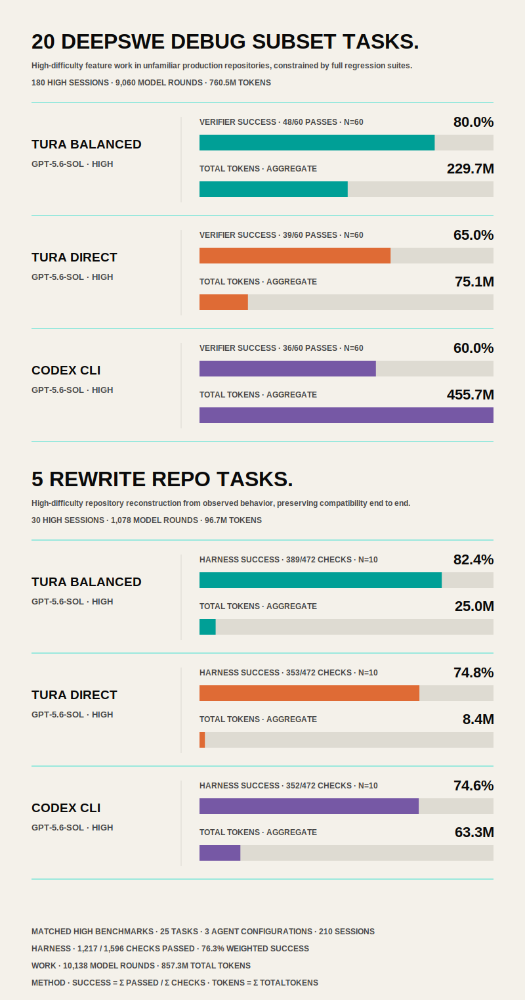

<p align="center">
  <a href="https://turaai.net/">
    
  </a>
</p>

<p align="center">
  <a href="https://turaai.net/"></a>
  <a href="https://turaai.net/benchmark"></a>
  <a href="https://www.npmjs.com/package/tura-ai"></a>
</p>

<h1 align="center">Tura: 16.7 points higher success. Up to 77.5% fewer tokens.</h1>

Tura is a local open-source coding agent built for developers who are tired of useless skills, extensions that claim they can save tokens, and agents that wreck repos without judgment.

Tura reduces model round trips and repeated context through its runtime and macro-command architecture. In the DeepSWE comparison, Balanced used 35.8% fewer turns and 31.1% fewer tokens than Codex CLI, while Direct used 69.1% fewer turns and 77.5% fewer tokens. Both Tura configurations ran GPT-5.6 SOL at High reasoning while still using fewer aggregate tokens than Codex CLI at Medium reasoning. Balanced prioritizes thorough investigation, implementation, and verification for higher task success; Direct follows a shorter execution path to minimize turn and token cost.[^debug-figure][^debug-manifests]

Long-horizon task [benchmarks](https://turaai.net/benchmark) are one way to measure coding-agent performance beyond isolated prompts. The published comparison uses harness-based development tasks with archived prompts, per-round tool calls, token usage, patches, and verifier results.
> On 20 DeepSWE v1.1 tasks run three times per agent (180 sessions), Tura Balanced passed 48/60 task verifiers (80.0%) versus Codex CLI's 38/60 (63.3%), a 16.7 percentage-point improvement. Tura Direct used 75.1M aggregate tokens versus Codex CLI's 333.5M, or 77.5% fewer, while passing 39/60 verifiers (65.0%), 1.7 points above Codex CLI. In short: Balanced used 31.1% fewer tokens and improved verifier success by 16.7 points; Direct used 77.5% fewer tokens and improved verifier success by 1.7 points.[^debug-figure][^debug-manifests]

The published artifacts compare the named Tura Balanced, Tura Direct, and Codex CLI configurations on the same benchmark tasks.[^debug-figure]

### Benchmark

<p align="center">
  
</p>

<p align="center"><em>Harness success and aggregate token usage across 25 high-difficulty tasks, 6 agent-and-model configurations, and 270 sessions. Source and calculation notes are linked below.</em></p>

### Screenshots

<p align="center">
  
</p>

<p align="center"><em>GUI page with multi-session concurrent work and HTML rich text support.</em></p>

<p align="center">
  
</p>

<p align="center"><em>TUI page with multi-session concurrent work and HTML rich text support.</em></p>

The results below are grounded in published benchmark artifacts rather than an uncited aggregate. Tura is built around three core systems:

## Macro CLI Command Run
Most coding agents still depend on repetitive tool-calling loops: inspect, wait, patch, wait, build, wait, test, wait.

***Tool-calling coding agent:***
```bash
# Turn 1 — inspect environment

rg -n "TODO|command_run|handler" crates/
rg --files crates/runtime/src crates/tools/src
```

```bash
# Turn 2 — apply patch

*** Begin Patch
*** Update File: crates/tools/src/command_run/handler.rs
@@
-    // old command handler logic
+    // patched command handler logic
*** End Patch
```

```bash
# Turn 3 — build

cargo build -p runtime
```

```bash
# Turn 4 — run tests

cargo test -p runtime --lib
```

```bash
# Turn 5 — run lint validation

cargo clippy -p runtime --all-targets
```

Tura takes a different approach. Instead of exposing dozens of small tools to the model, Tura exposes a single macro tool: `command_run`. This lets the agent construct a multi-step execution tree and run related actions in one LLM turn.

In the example below, Tura finishes in one LLM turn what a normal tool-calling agent needs five turns to complete. Both agents run the same commands. The difference is that Tura executes them as one structured macro workflow, while the traditional agent must pay the cost of repeated model round trips.

***Tura macro CLI command:***
```json
{
  "name": "command_run",
  "arguments": {
    "commands": [
      { "step": 1, "command_type": "shell_command", "command_line": "rg -n \"TODO|command_run|handler\" crates/" },
      { "step": 1, "command_type": "shell_command", "command_line": "rg --files crates/runtime/src crates/tools/src" },
      { "step": 2, "command_type": "apply_patch", "command_line": "*** Begin Patch\n*** Update File: crates/tools/src/command_run/handler.rs\n@@\n-    // old command handler logic\n+    // patched command handler logic\n*** End Patch" },
      { "step": 3, "command_type": "shell_command", "command_line": "cargo build -p runtime" },
      { "step": 4, "command_type": "shell_command", "command_line": "cargo test -p runtime --lib" },
      { "step": 4, "command_type": "shell_command", "command_line": "cargo clippy -p runtime --all-targets" }
    ]
  }
}
```
There is no ablation test proving that `command_run` alone causes Tura's lower turn and token usage. Across the full DeepSWE comparison, however, Balanced used 35.8% fewer turns and 31.1% fewer tokens than Codex CLI, while Direct used 69.1% fewer turns and 77.5% fewer tokens.[^debug-figure][^debug-manifests]


## Backward Reasoning
However impressive LLMs can be, an LLM is still, at its core, a statistical induction model over text-token probabilities.

For example, asking an LLM to choose among rock, paper, and scissors does not guarantee a uniform random result. If a true one-in-three distribution matters, the choice needs an external random-number source rather than an uncited assumption about model output probabilities.

In coding tasks, this is often fatal.

An agent is more likely to execute and generate code and logic that are statistically more common. But common code and common logic are often mediocre and under-considered.

Tura uses a different strategy.

During reasoning, a common agent reasons from the current state to the prompt goal. In that case, $s_1$ is the current state, and $s_n$ is the goal given by the user prompt.

$$
s_1 \rightarrow s_2 \rightarrow s_3 \rightarrow \cdots \rightarrow s_n
$$

Instead, Tura guides the LLM to statistically estimate $s_{n-1}$ first, then reason backward from the state of $s_{n-1}$ to $s_{n-2}$.

In the example below, the LLM can derive the optimal strategy for playing rock-paper-scissors correctly.


```
> To keep rock-paper-scissors fair and challenging,
> We need unbiased play.
> Each move must have a true one-in-three chance.
> An LLM cannot guarantee that from text probabilities alone.
> Use a random-number generator script to generate randint(1, 3)
> Then map rock, paper, or scissors to the number.
```

In programming tasks, this means that when an agent sees a goal like fixing a frontend bug, it is guided to reason through the full execution path, reconstruct the failure state, and identify the root cause before writing code. In the published DeepSWE comparison, Tura Balanced passed 10 more of 60 binary task verifiers than Codex CLI; in the GPT-5.6 rewrite comparison, it passed 389/472 checks versus 351/472 for Codex CLI.[^debug-manifests][^rewrite-manifest]


## Runtime Context and Prompt Manager

Skills are often just weaker prompts loaded into context.

In many agent frameworks, a long-lived session keeps accumulating skill files, tool outputs, and stale task history. When the context becomes too large, the agent enters a separate compaction turn, but that compaction usually preserves only a compressed summary. Important execution details can become vague or lost.

Tura treats context as part of the runtime state machine.

Instead of relying on users to manually reset sessions or letting Markdown skills pile up, Tura uses `task_status`, runtime prompts, and recursive execution manuals to keep the active context scoped to the current task.

| Area | Traditional Skill-Based Agent | Tura |
|---|---|---|
| Session model | Same session keeps running until the user manually starts a new one | Session state can be renamed, refreshed, and managed automatically |
| Skill loading | Loads Markdown skill files into context | Dynamically loads task-specific runtime prompts and execution manuals |
| Prompt strength | Skills behave like weak contextual instructions or tool output | Runtime prompts are tied to the active task state |
| Context pollution | Old skills and irrelevant context remain active until compacted or reset | Irrelevant context can be removed, compacted, or replaced |
| Compaction | Separate long compaction turn | Compaction is handled as a CLI operation |
| Information preserved | Usually compressed summaries only | Code locations, patches, tests, and task status can be preserved |
| Token cost | High because stale context stays active | Lower because context is task-scoped |
| Failure mode | Agent mixes old tasks, vague summaries, and irrelevant skills | Agent keeps execution aligned with the current task |
| Tool/manual loading | Broad skills are loaded even when only part is useful | CLI commands and manuals are loaded through a recursive task tree |

Because compaction is a CLI operation, Tura can preserve exact execution state in `task_status.compact_context`. In the published benchmark sessions, Tura moved beyond read-only inspection and resumed execution an average of 2.6 rounds after compaction, compared with an estimated 5.4 rounds for Codex.[^compact-dynamodb][^compact-wasmi-r1][^compact-wasmi-r2][^compact-wasmi-r3][^compact-eza]

Tura's 2.6-round result is calculated from explicit `compact_context` events in its archived round contracts. Codex does not expose equivalent compaction events, so its 5.4-round result is estimated from points where input-token usage drops sharply, excluding identifiable media-reading boundaries.


## Install and run

### NPM release

Mac and Linux:

```bash
npm install tura-ai
tura
tura exec "Inspect this workspace and summarize the risky parts"
```

Windows:

```powershell
npm install -g tura-ai
tura
tura exec "Inspect this workspace and summarize the risky parts"
```

### Source checkout

Windows PowerShell:

```powershell
git clone https://github.com/Tura-AI/tura.git
cd tura
.\scripts\install.ps1
.\scripts\build-release.ps1
.\scripts\register-cli.ps1
tura exec "Inspect this workspace"
```

macOS or Linux shell:

```bash
git clone https://github.com/Tura-AI/tura.git
cd tura
./scripts/install.sh
./scripts/build-release.sh
./scripts/register-cli.sh
tura exec "Inspect this workspace"
```

### Common entrypoints

| Entry | Use it for |
| --- | --- |
| `tura` | Interactive terminal UI. |
| `tura "prompt"` | Open the TUI with an initial prompt. |
| `tura exec "prompt"` | Direct Rust CLI prompt runner. |
| `tura run "prompt"` | Gateway-backed prompt with streaming/history. |
| `tura bash`, `tura zsh`, `tura shel` | Prompt with a selected command-run shell surface. |
| `tura_gateway` | Local HTTP/SSE gateway and optional web GUI serving. |
| `tura_gui` | Desktop GUI workspace client. |

For OS-specific PATH requirements, executor installation, and how to register the
CLI when the executable is not on PATH, read
[How to start](docs/start/how-to-start.md). For command flags and modes, read
[CLI parameters](docs/start/cli-parameters.md).

## Documentation

The GitBook-style documentation index is [docs/SUMMARY.md](docs/SUMMARY.md). The
full navigation page is [docs/start/navigation.md](docs/start/navigation.md).

### Start

- [Overview](docs/start/overview.md)
- [Install](docs/start/install.md)
- [How to start](docs/start/how-to-start.md)
- [CLI parameters](docs/start/cli-parameters.md)
- [Settings](docs/start/settings.md)
- [Providers](docs/start/providers.md)
- [Sessions](docs/start/sessions.md)
- [Navigation](docs/start/navigation.md)

### Core

- [Task status](docs/core/task-status.md)
- [Context management](docs/core/context-management.md)
- [Runtime prompt](docs/core/runtime-prompt.md)
- [Command run](docs/core/command-run.md)
- [Commands](docs/core/commands.md)
- [Agents](docs/core/agents.md)
- [Personas](docs/core/personas.md)
- [Rich text](docs/core/html-rich-text.md)
- [Dynamic prompt injection](docs/core/prompt-style.md)

### Architecture

- [Session DB](crates/session_log/ARCHITECTURE.md)
- [Gateway](crates/gateway/ARCHITECTURE.md)
- [Router](crates/router/ARCHITECTURE.md)
- [Runtime](crates/runtime/ARCHITECTURE.md)
- [Tool](crates/tools/ARCHITECTURE.md)
- [Terminal user interface](apps/tui/ARCHITECTURE.md)
- [Graphic user interface](apps/gui/ARCHITECTURE.md)

### Customization

- [Custom providers](docs/customization/custom-providers.md)
- [Custom personas](docs/customization/custom-personas.md)
- [Custom agents](docs/customization/custom-agents.md)
- [Custom runtime prompt](docs/customization/custom-runtime-prompt.md)
- [Custom commands](docs/customization/custom-commands.md)

### Development

- [Scripts](scripts/ARCHITECTURE.md)
- [Testing](scripts/ARCHITECTURE.md#xtask-test-collection-scripts)
- [Environment](docs/start/settings.md)
- [Architecture](ARCHITECTURE.md)
- [Benchmark](https://turaai.net/benchmark)

## License

Tura is licensed under AGPL-3.0-or-later. See [LICENSE](LICENSE).

## Benchmark notes and sources

The headline compares Tura Balanced and Tura Direct GPT-5.6 SOL High with Codex CLI GPT-5.6 SOL Medium on the DeepSWE group shown in the benchmark figure. "Success" is the binary DeepSWE verifier result summed over 60 sessions per agent. Balanced's reductions are `(3,140 - 2,017) / 3,140 = 35.8%` for turns and `(333.5M - 229.7M) / 333.5M = 31.1%` for tokens. Direct's reductions are `(3,140 - 969) / 3,140 = 69.1%` for turns and `(333.5M - 75.1M) / 333.5M = 77.5%` for tokens. Rewrite success is `sum(passed) / sum(total)` over the canonical manifest; it is not an average of per-run percentages. The reasoning-effort difference is part of the named configurations, not proof that architecture alone caused the measured outcome.[^debug-figure][^debug-manifests][^rewrite-manifest]

[^debug-figure]: [DeepSWE and Rewrite Repo comparison figure](assets/data/benchmark-agent-comparison.svg). The figure states the task, session, verifier, turn, token, and aggregation scopes used by the README.
[^debug-manifests]: [`tura-benchmark` DeepSWE replicate 1](https://github.com/Tura-AI/benchmark/blob/main/results/debug/report-deepswe-v1.1-gpt56-sol-local-r01/manifest.json), [replicate 2](https://github.com/Tura-AI/benchmark/blob/main/results/debug/report-deepswe-v1.1-gpt56-sol-local-r02/manifest.json), and [replicate 3](https://github.com/Tura-AI/benchmark/blob/main/results/debug/report-deepswe-v1.1-gpt56-sol-local-r03/manifest.json). Each manifest contains 20 tasks across the same three agent configurations; together they contain 180 sessions.
[^rewrite-manifest]: [`tura-benchmark` GPT-5.6 Rewrite Repo canonical manifest](https://github.com/Tura-AI/benchmark/blob/main/results/rewrite/report-20260710-gpt56-sol/canonical-manifest.json). The cited totals are Tura Balanced 389/472 and Codex CLI 351/472 across 10 sessions each.
[^compact-dynamodb]: [`tura-benchmark` DynamoDB round 107 compact](https://github.com/Tura-AI/benchmark/blob/main/results/debug/report-deepswe-v1.1-gpt56-sol-local-r01/dynamodb-toolbox-conditional-attribute-requirements/tura-balanced/dynamodb-toolbox-conditional-attribute-requirements-tura-balanced-run-01/metadata/contracts/rounds/round-0107.json) and [round 114 first later patch](https://github.com/Tura-AI/benchmark/blob/main/results/debug/report-deepswe-v1.1-gpt56-sol-local-r01/dynamodb-toolbox-conditional-attribute-requirements/tura-balanced/dynamodb-toolbox-conditional-attribute-requirements-tura-balanced-run-01/metadata/contracts/rounds/round-0114.json).
[^compact-wasmi-r1]: [`tura-benchmark` Wasmi replicate 1 round 43 compact](https://github.com/Tura-AI/benchmark/blob/main/results/debug/report-deepswe-v1.1-gpt56-sol-local-r01/wasmi-trap-coredumps/tura-balanced/wasmi-trap-coredumps-tura-balanced-run-01/metadata/contracts/rounds/round-0043.json) and [round 44 first non-read action](https://github.com/Tura-AI/benchmark/blob/main/results/debug/report-deepswe-v1.1-gpt56-sol-local-r01/wasmi-trap-coredumps/tura-balanced/wasmi-trap-coredumps-tura-balanced-run-01/metadata/contracts/rounds/round-0044.json). The run ends at round 46 without a later patch or test action.
[^compact-wasmi-r2]: [`tura-benchmark` Wasmi replicate 2 round 26 compact](https://github.com/Tura-AI/benchmark/blob/main/results/debug/report-deepswe-v1.1-gpt56-sol-local-r02/wasmi-trap-coredumps/tura-balanced/wasmi-trap-coredumps-tura-balanced-run-02/metadata/contracts/rounds/round-0026.json), [round 28 first non-read action](https://github.com/Tura-AI/benchmark/blob/main/results/debug/report-deepswe-v1.1-gpt56-sol-local-r02/wasmi-trap-coredumps/tura-balanced/wasmi-trap-coredumps-tura-balanced-run-02/metadata/contracts/rounds/round-0028.json), and [round 39 first later patch/test](https://github.com/Tura-AI/benchmark/blob/main/results/debug/report-deepswe-v1.1-gpt56-sol-local-r02/wasmi-trap-coredumps/tura-balanced/wasmi-trap-coredumps-tura-balanced-run-02/metadata/contracts/rounds/round-0039.json).
[^compact-wasmi-r3]: [`tura-benchmark` Wasmi replicate 3 round 39 compact](https://github.com/Tura-AI/benchmark/blob/main/results/debug/report-deepswe-v1.1-gpt56-sol-local-r03/wasmi-trap-coredumps/tura-balanced/wasmi-trap-coredumps-tura-balanced-run-03/metadata/contracts/rounds/round-0039.json) and [round 41 first later patch/test](https://github.com/Tura-AI/benchmark/blob/main/results/debug/report-deepswe-v1.1-gpt56-sol-local-r03/wasmi-trap-coredumps/tura-balanced/wasmi-trap-coredumps-tura-balanced-run-03/metadata/contracts/rounds/round-0041.json).
[^compact-eza]: [`tura-benchmark` eza round 23 compact](https://github.com/Tura-AI/benchmark/blob/main/results/rewrite/report-20260710-gpt56-sol/eza/tura-balanced/eza-tura-balanced-gpt56-sol-run-02/metadata/contracts/rounds/round-0023.json) and [round 24 first later test](https://github.com/Tura-AI/benchmark/blob/main/results/rewrite/report-20260710-gpt56-sol/eza/tura-balanced/eza-tura-balanced-gpt56-sol-run-02/metadata/contracts/rounds/round-0024.json).
