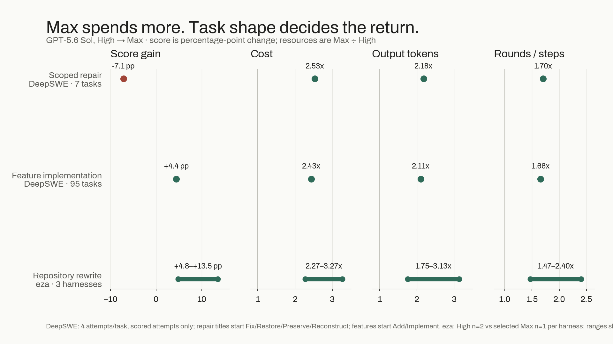
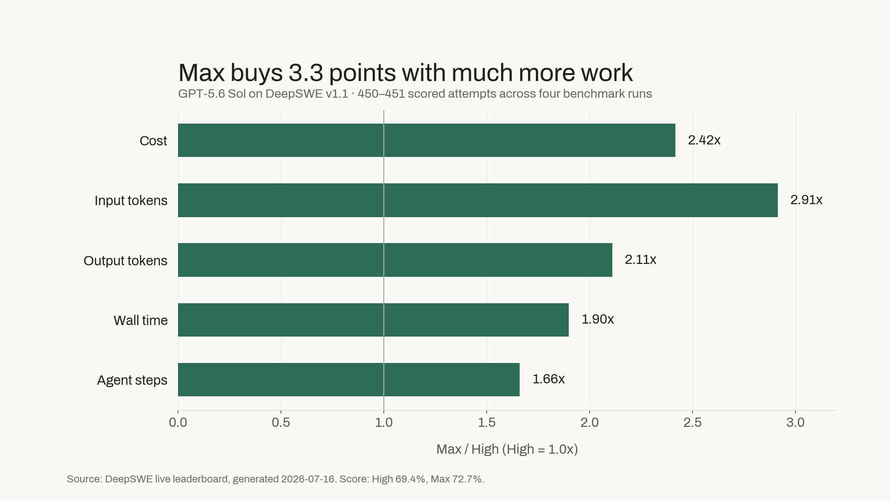
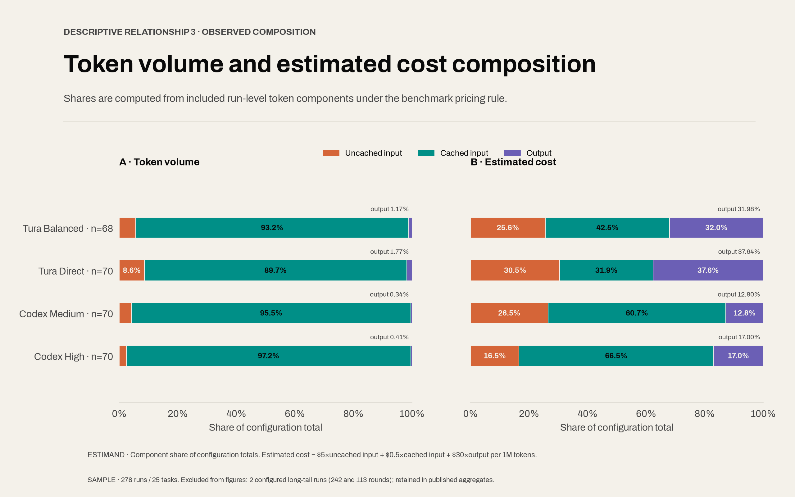
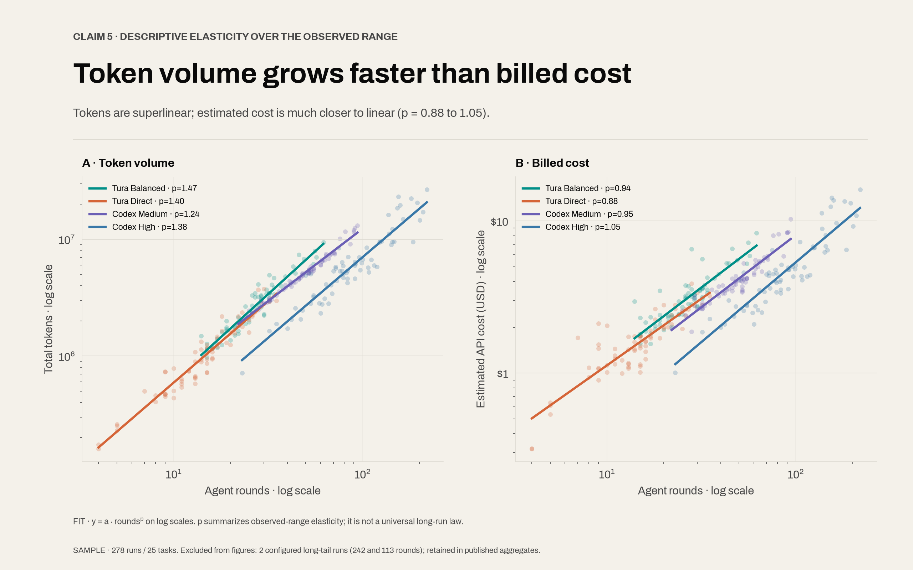

# Is GPT-5.6 Sol Max Worth It?

Short answer: **High fixes. Max builds.**

Max buys more search, revision, and agent rounds. That helps when the model must discover the path through a rewrite, migration, or new project. A bounded bug with a failing test has far less uncertainty left to buy. The data supports no universal default: task and harness change the return while the bill grows quickly.

## The task decides whether Max has work to do

The clearest split comes from two datasets: the public [DeepSWE v1.1 task and trial records](https://deepswe.datacurve.ai/data/v1.1), and Tura's eza Rust-to-Python rewrite.

| Task shape | High | Max | Score change | Cost | Output tokens | Rounds / steps |
| --- | ---: | ---: | ---: | ---: | ---: | ---: |
| Scoped repair, DeepSWE (7 tasks) | 64.3% | 57.1% | **-7.1 pp** | 2.53x | 2.18x | 1.70x |
| Feature implementation, DeepSWE (95 tasks) | 70.2% | 74.6% | **+4.4 pp** | 2.43x | 2.11x | 1.66x |
| Repository rewrite, eza (3 harnesses) | 78.8-89.4% | 92.3-94.2% | **+4.8 to +13.5 pp** | 2.27-3.27x | 1.75-3.13x | 1.47-2.40x |

  

<em>Max spends more in every task class. The score return depends on the work.</em>

The DeepSWE classification is intentionally mechanical:

| Group | Inclusion rule | Tasks | Scored attempts |
| --- | --- | ---: | ---: |
| Scoped repair | Title starts with `Fix`, `Restore`, `Preserve`, or `Reconstruct` | 7 | 28 High + 28 Max |
| Feature implementation | Title starts with `Add` or `Implement` | 95 | 379 High + 378 Max |
| Excluded | Title matches neither rule | 11 | Not used in the split |

Three verifier timeouts follow DeepSWE's exclusion rules. Seven repair tasks cannot prove that Max generally hurts fixes; they can disprove the assumption that it always helps.

For eza, High is the mean of two runs per harness; Max is one selected run. The [artifacts](https://github.com/Tura-AI/benchmark/tree/main/blog_data/eza-replication-gpt56-max-20260717) are public.

| eza rewrite harness | High | Max | Gain | Cost | Output | Reasoning | Rounds |
| --- | ---: | ---: | ---: | ---: | ---: | ---: | ---: |
| Tura Balanced | 89.4% | 94.2% | +4.8 pp | 2.39x | 3.13x | 4.83x | 2.40x |
| Tura Direct | 79.8% | 92.3% | +12.5 pp | 3.27x | 3.02x | 5.31x | 2.25x |
| Codex CLI | 78.8% | 92.3% | +13.5 pp | 2.27x | 1.75x | 2.34x | 1.47x |

| Max run | Checks | Cost | Output | Reasoning | Rounds | Duration |
| --- | ---: | ---: | ---: | ---: | ---: | ---: |
| Tura Balanced | 49/52 | $14.55 | 218.4k | 113.1k | 72 | 98.9 min |
| Tura Direct | 48/52 | $6.26 | 114.7k | 81.9k | 18 | 53.7 min |
| Codex CLI | 48/52 | $12.01 | 69.2k | 30.2k | 92 | 30.9 min |

Direct and Codex move from about four checks in five to more than nine in ten. A rewrite leaves enough unresolved behavior and compatibility work for Max to reach the artifact.

## DeepSWE shows the average price

DeepSWE is the cleanest broad comparison because it holds the 113 tasks and mini-swe-agent harness fixed across four full runs per effort level.

| GPT-5.6 Sol | Pass@1 | Cost / task | Output | Input | Time | Steps |
| --- | ---: | ---: | ---: | ---: | ---: | ---: |
| High | 69.4% | $3.47 | 28.5k | 2.71M | 9.9 min | 36.9 |
| Max | 72.7% | $8.39 | 60.0k | 7.91M | 18.8 min | 61.3 |
| Max / High | **+3.3 pp** | **2.42x** | **2.11x** | **2.91x** | **1.90x** | **1.66x** |

  

<em>Max adds 3.3 points while every measured resource rises much faster.</em>

That works out to about one additional passing attempt per 31 attempts. Cost per expected pass rises from roughly $5.00 at High to $11.54 at Max.

The intermediate setting shows the curve flattening before Max:

| Effort | Pass@1 | Cost/task | Gain vs previous | Cost increase |
| --- | ---: | ---: | ---: | ---: |
| High | 69.4% | $3.47 | - | - |
| XHigh | 70.7% | $4.70 | +1.3 pp | +35% |
| Max | 72.7% | $8.39 | +2.0 pp | +78% |

DeepSWE is not a small bug-fix benchmark. Its own report says bug localization and refactoring are under-represented. The published task statistics make the scope visible:

| Benchmark | Mean prompt | Reference lines added | Files edited | Repositories |
| --- | ---: | ---: | ---: | ---: |
| SWE-bench Verified | 1,700 chars | 10 | 1 | 12 |
| SWE-bench Pro Public | 4,614 chars | 120 | 5 | 11 |
| DeepSWE | 2,158 chars | **668** | **7** | **91** |

DeepSWE gives a long-horizon average, not a verdict on every bug. Its aggregate hides routing information.

## OpenAI proves strength, not marginal value

OpenAI's [GPT-5.6 launch report](https://openai.com/index/gpt-5-6/) establishes that Sol Max is a top coding configuration:

| OpenAI-published coding result | Sol Max | Evaluation surface |
| --- | ---: | --- |
| Artificial Analysis Coding Agent Index v1.1 | **80** | Composite coding-agent index |
| DeepSWE v1.1 | **72.7%** | Long-horizon repository implementation |
| Terminal-Bench 2.1 | **88.8%** | Complex command-line work in containers |

OpenAI also reports Sol Max beating Fable 5 on the Coding Agent Index by 2.8 points while using less than half the output, less than half the time, and about one-third lower estimated cost.

| OpenAI's Sol Max vs Fable 5 claim | Reported result |
| --- | ---: |
| Coding Agent Index advantage | +2.8 points |
| Output tokens | Less than 0.5x |
| Completion time | Less than 0.5x |
| Estimated cost | About 33% lower |

The official API price also explains why output discipline matters:

| GPT-5.6 Sol API usage | Price per 1M tokens |
| --- | ---: |
| Uncached input | $5.00 |
| Cache read | $0.50 |
| Cache write | $6.25 |
| Output | $30.00 |

These cross-model results prove strength, not the economics of moving Sol from High to Max. DeepSWE measures that: +3.3 points for 2.42x cost.

Artificial Analysis provides an independent within-model comparison:

| Artificial Analysis | XHigh | Max | Max change |
| --- | ---: | ---: | ---: |
| Intelligence Index | 58 | 59 | +1 point |
| Time to first token | 44.58s | 145.61s | 3.27x |

One index point can matter. So can 3.27x longer startup latency.

## What third-party data actually says

Third-party numbers cover different tasks and cannot be merged into one score.

| Third-party source | Dataset | Published numbers | What it supports |
| --- | --- | --- | --- |
| [ARC Prize](https://arcprize.org/blog/gpt-5-6) | ARC-AGI-3 | Sol High 2.1%; Max 7.8%; **+5.7 pp / 3.7x relative** | Direct evidence that Max can cross a hard abstraction threshold |
| [FutureSearch](https://futuresearch.ai/effort-scaling/) | 150+ web-research tasks | GPT-5 Low 49.6%, $0.25, 230s; High 48.1%, $0.39, 217s | More effort can cost more and score less when reasoning is not the bottleneck |
| [Bai et al.](https://arxiv.org/abs/2604.22750) | 8 models on SWE-bench Verified | Agent tasks use about 1000x code-chat tokens; same-task runs vary up to 30x; self-prediction correlation at most 0.39 | Token volume is stochastic and does not reliably predict success |
| [SWE-Atlas QnA](https://labs.scale.com/leaderboard/sweatlas-qna) | Real-repository comprehension | Frontier ceiling about 35%; GPT-5.4 used more than 2x Opus operations; top answers exceed 1,200 words | Long trajectories can be useful when evidence gathering is the deliverable |
| [CodeRabbit](https://www.coderabbit.ai/blog/gpt-5-6-sol-and-terra-benchmark) | 100+ long-horizon coding tasks | Sol 63.7% and 20,968 output/task; Terra 40.7% and 55,594 output/task | Cheaper token pricing does not guarantee cheaper solved tasks |

FutureSearch is especially useful because it publishes the whole operating point rather than only the winning score:

| Model | Effort | Score | Cost/task | Time |
| --- | --- | ---: | ---: | ---: |
| Claude 4.6 Opus | Low | 53.1% | $0.24 | 73s |
| Claude 4.6 Opus | High | 55.0% | $0.55 | 183s |
| Claude 4.6 Sonnet | Low | 50.4% | $0.27 | 130s |
| Claude 4.6 Sonnet | High | 54.9% | $0.46 | 262s |
| GPT-5 | Low | 49.6% | $0.25 | 230s |
| GPT-5 | High | 48.1% | $0.39 | 217s |
| Gemini 3 Flash | Low | 49.9% | $0.05 | 96s |
| Gemini 3 Flash | High | 47.9% | $0.14 | 182s |

Here, effort helps Claude 4.6 and hurts GPT-5 and Gemini. Evaluate the setting in its actual harness.

CodeRabbit's review harness adds a second warning about raw output:

| CodeRabbit review result | Sol | Terra |
| --- | ---: | ---: |
| Actionable passes | 69/99 (69.7%) | 53/101 (52.5%) |
| Actionable precision | 31.6% | 35.7% |
| Raw comments | 231 | 143 |

More output can raise recall while lowering precision. This is product data, not a Sol High-to-Max comparison.

## The harness decides what an extra token means

In Tura's 277 usage-available runs, output predicts success in one harness family and not the other:

| Output vs success | Runs | Task-adjusted relationship | Interpretation |
| --- | ---: | ---: | --- |
| Tura family | 137 | r=0.44, p<0.000001 | Positive association, driven by Direct |
| Tura Direct | 70 | r=0.51, p<0.00001 | More output often tracks implementation work |
| Tura Balanced | 67 | r=-0.10, p=0.41 | No useful association |
| Codex family | 140 | r=0.03, p=0.73 | No association |
| Codex High, raw rank | 70 | rho=-0.13, p=0.29 | Negative direction, not statistically conclusive |

The bill also has different composition:

| Harness family | Output share of tokens | Output share of modeled cost |
| --- | ---: | ---: |
| Tura | 1.17-1.77% | 31.98-37.64% |
| Codex | 0.34-0.41% | 12.80-17.00% |

  

<em>Output is a small part of volume and a much larger part of cost.</em>

Rounds make the problem compound. Across 278 analyzed runs, total token volume grows superlinearly with round count:

| Configuration | Token exponent | Cost exponent |
| --- | ---: | ---: |
| Tura Balanced | 1.47 | 0.94 |
| Tura Direct | 1.40 | 0.88 |
| Codex Medium | 1.24 | 0.95 |
| Codex High | 1.38 | 1.05 |

  

<em>Doubling rounds tends to more than double tokens; caching keeps cost nearer linear.</em>

In eza, Balanced grew from 30 to 72 rounds, Direct from 8 to 18, and Codex from 62.5 to 92. Max magnifies the loop: tests or second-guessing, depending on the harness.

## Greenfield is plausible, not proven

Public data supports GPT-5.6 on new projects, but there is no matched Sol High-to-Max greenfield benchmark yet.

| Source | Greenfield-related data | Limitation |
| --- | --- | --- |
| OpenAI / Base44 | 30 app-building conversations; GPT-5.6 used 22% less input and 23% less output than GPT-5.5 while staying competitive | Model-generation comparison, not High vs Max |
| CodeRabbit | Sol passed 63.7% of 100+ long-horizon tasks | Sol vs Terra, not effort ablation |
| SWE-Atlas | Native scaffolds improved frontier models; top model ran hundreds of commands | Codebase comprehension, not app construction |

Greenfield has more architectural decisions, so Max has somewhere to spend search. This is a **routing judgment**, not a measured High-to-Max gain.

## The rule I would use

| Task | Start with | Escalate when |
| --- | --- | --- |
| Bounded bug or scoped change | **High** | Localization remains uncertain or High fails |
| Feature implementation | **High** | Failure is expensive enough to justify about 2.4x cost |
| Rewrite or migration | **Max is often justified** | Compatibility surface is broad and externally verified |
| Greenfield product | **High or Max by scope** | One agent owns architecture, implementation, and verification |

The conclusion is not "Max is too expensive." It is more specific:

**High closes known gaps. Max is worth paying for when the agent still has to build the path.**
