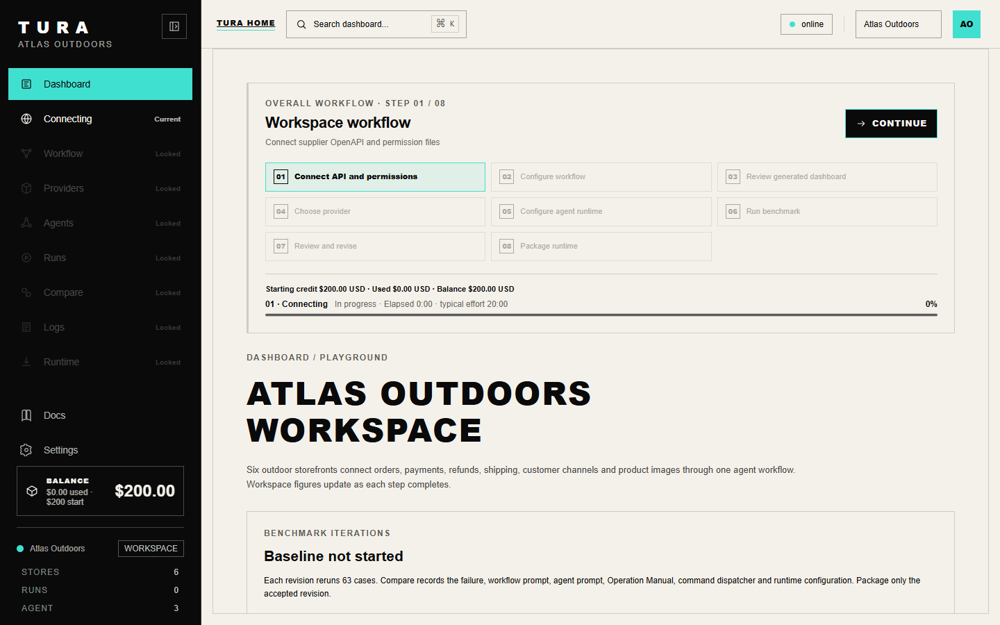
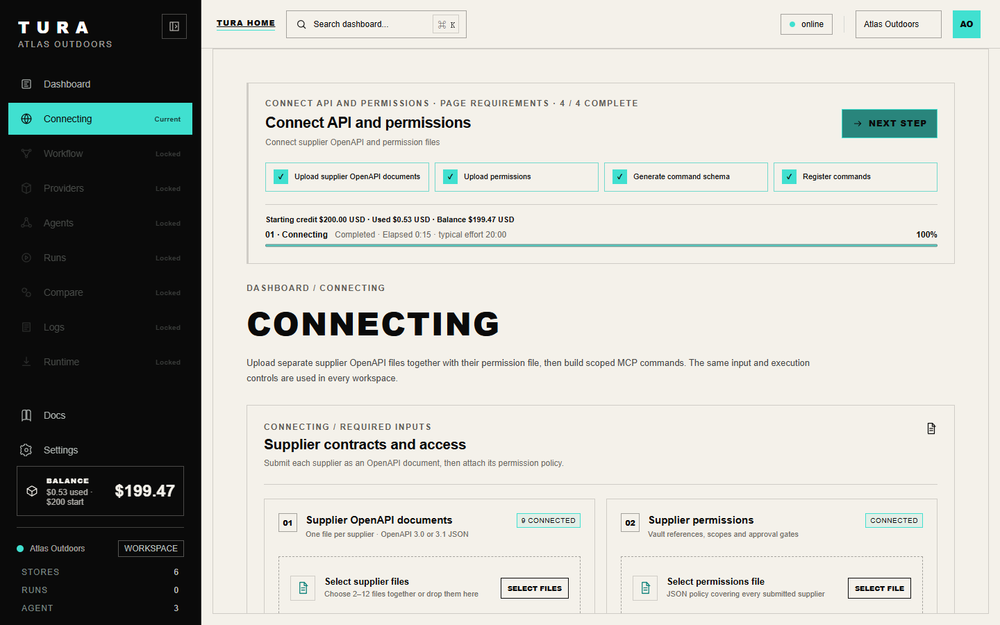
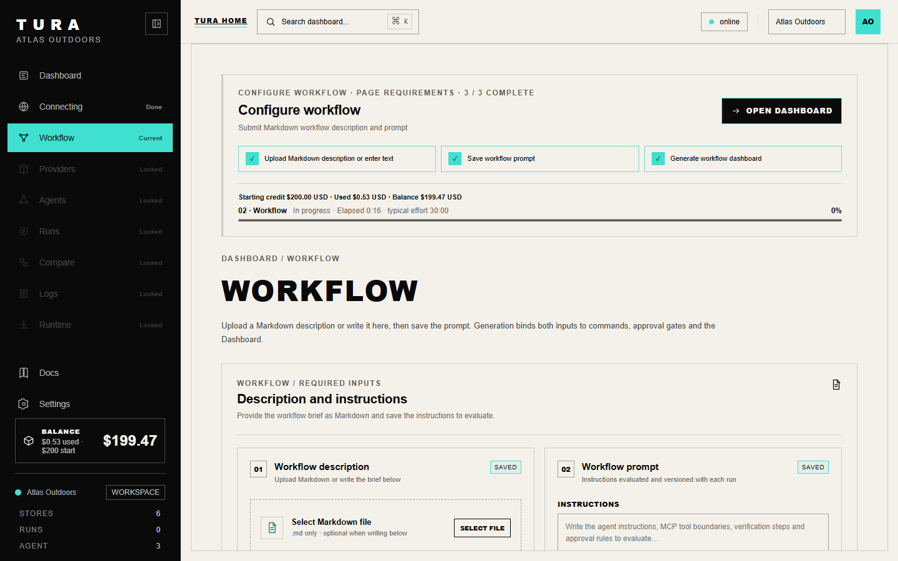
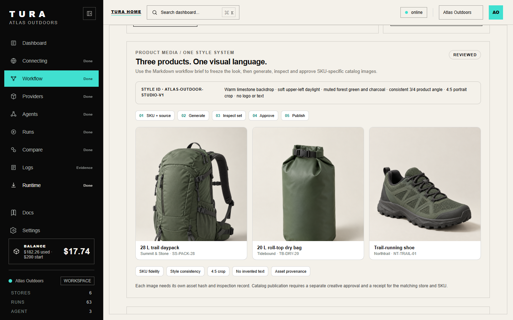
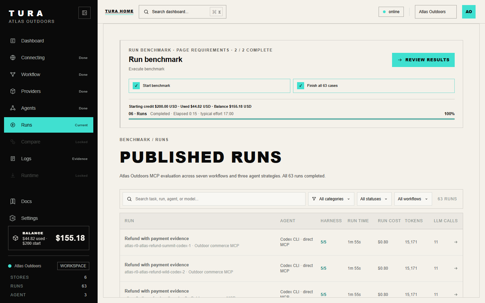
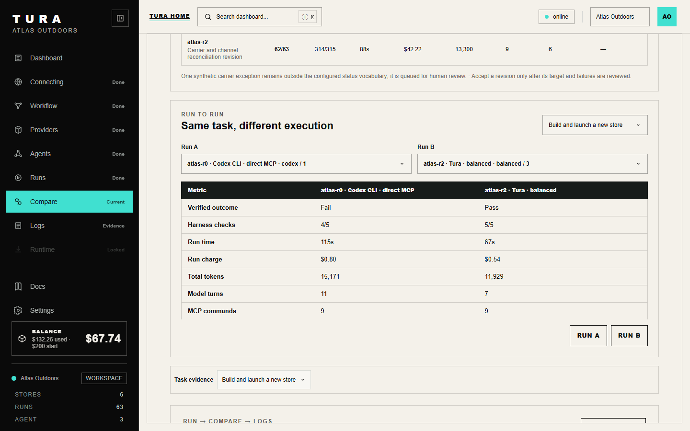
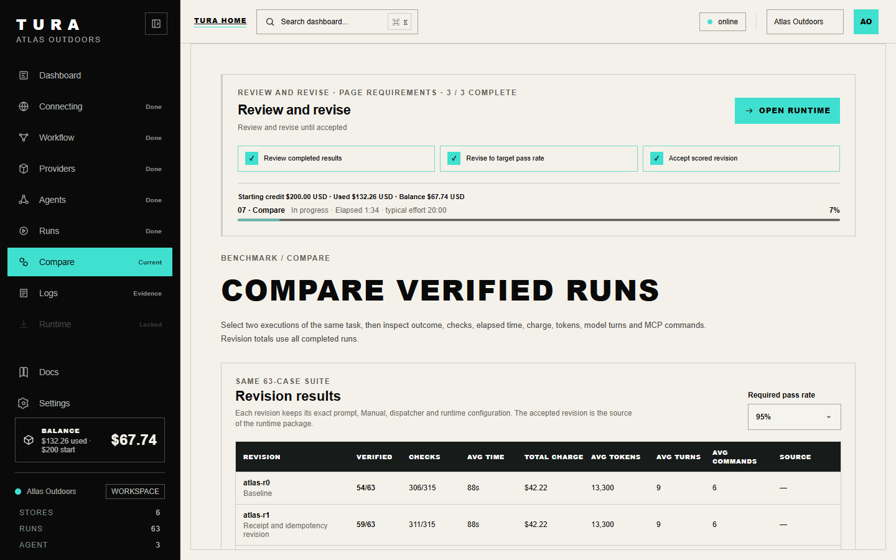
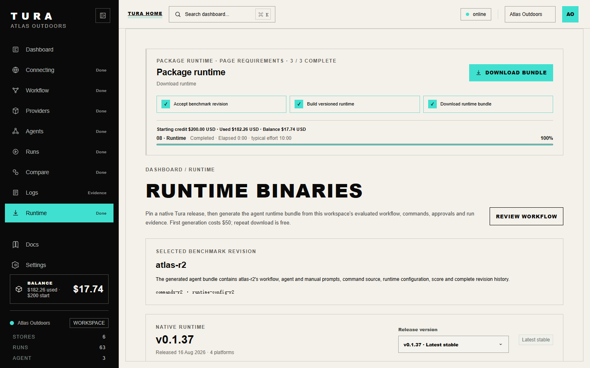

# Tura Agent Runtime product workflow

## Purpose and status

This document describes the complete Atlas Outdoors product scenario from company APIs to an evaluated Agent Runtime. It expands the supplied 15 page workflow guide into an operating specification that a product, engineering, or customer team can review.

Atlas Outdoors is a worked scenario using isolated service records and interface captures. Its benchmark scores, wallet balances, and package screens are scenario evidence. They do not establish live supplier performance, independent benchmark results, or general pricing for every customer. The commercial runtime and savings terms below describe the proposed Atlas handoff.

The product goal is to make the agent development loop repeatable. A company supplies contracts for its internal and supplier APIs, permissions, workflow, and success conditions. Tura registers governed commands, builds an agent configuration, tests whole tasks, revises failures, and packages the explicitly accepted version for the company's environment.

## The company workflow

Atlas operates six outdoor commerce sites across USD, EUR, GBP, and CAD. Five are active storefronts. Field & Forest is a new site in staging. Payment records, shipping carriers, support inboxes, messaging accounts, and product media are connected through one control plane, while each store keeps its own customers, credentials, inventory, orders, and currency.

| Site | Role in the scenario | Currency scope |
| --- | --- | --- |
| Summit & Stone | Hiking gear, refunds, product media | USD |
| Tidebound | Water sports, carrier exceptions, product media | USD and GBP |
| Wild Camp Co. | Camping, fulfillment | EUR and GBP |
| Ridge Cycle | Cycling, shared support boundary | EUR and USD |
| Northtrail | Trail running, cross channel support, product media | EUR and CAD |
| Field & Forest | New outdoor lifestyle site in staging | USD |

The workspace has eight gated stages: Connecting, Workflow, Dashboard, Providers, Agents, Runs, Compare, and Runtime. Logs is an evidence view used during execution and review. It is not a ninth stage. The next stage unlocks when its preceding inputs and checks are complete.

## 1. Connecting: register trusted commands

**Company inputs.** Upload nine supplier OpenAPI JSON files together, then upload `permissions.json` separately. The contracts cover storefront operations, Stripe, shipping, an inbox gateway, reports, WhatsApp, Telegram, email, and media. The access file defines roles, store and account scope, approval gates, and vault references. Documentation alone does not grant permission to execute an operation.

**Tura processing.** Validate required operations and parameter schemas, map each operation to its source and authorization rule, and register 22 typed, store scoped commands. MCP discovery exposes the permitted operations through `initialize`, `tools/list`, and `tools/call`. Supplier credentials remain behind vault references and should not appear in prompts, traces, or delivered files.

**Gate and output.** Registration completes only when required API operations and permission sources validate. The output is a scoped command registry with source IDs, parameter schemas, access policy, and approval requirements.

## 2. Workflow: define the actual work

**Company inputs.** Upload or write a Markdown workflow description and save a separate workflow prompt. The description names representative tasks, triggers, operating limits, allowed stores, approvals, exception behavior, and success conditions. Both inputs are required before generation.

**Tura processing.** Bind each task to registered commands. Turn the expected outcome into final state assertions and evidence requirements. Save the description and prompt by revision. Generate the workflow configuration and the task aware Dashboard view.

**Gate and output.** The generated contract and Dashboard must be ready for review. A generated prompt is a suggestion until the user explicitly saves or applies it.

### Seven task contracts

Each task starts from isolated state in the benchmark. The agent's written answer is useful only when the provider state and receipts match the task contract.

| Task | Required work | Verification and stop condition |
| --- | --- | --- |
| Partial refund | Match a Summit & Stone order to its captured payment, approve a $49 refund, and create it with a stable idempotency key. | Exactly one refund exists, with the correct store, amount, payment, approval, and provider receipt. Stop on a scope mismatch, missing approval, or uncertain provider result. |
| Delivery exception | Read the latest DHL event for a Tidebound order, draft a customer update, approve the send, and use the originating channel. | Cite the carrier event and send receipt. Do not invent an ETA. Hold unfamiliar or out of order carrier statuses for review. |
| Shared inbox | Resolve customer and order identity across email, WhatsApp, and Telegram, then merge duplicate source messages into one audited thread. | Preserve account and store boundaries, source IDs, and send approval. Stop on an ambiguous identity or unlisted account. |
| Fulfillment | Confirm a captured payment and stock, reserve inventory once, approve the carrier label, and return tracking. | One reservation and one label with provider receipts. Stop on missing capture, stock, address, or uncertain label status. |
| Site launch | Build Field & Forest in staging, import catalog and inventory, configure tax and shipping, verify the domain, test Stripe checkout, refund, and webhook. | Stripe live mode and publication require separate approvals and final state checks. Do not call the site live after a test checkout alone. |
| Reconciliation | Join orders, payments, refunds, and reports by store and currency, then export a six store daily close. | Include all six stores, keep currencies separate, count each refund once, flag unmatched payments, and retain the export receipt. |
| Product media | Generate a daypack, dry bag, and trail shoe from one style brief, inspect each SKU, then seek creative approval before catalog publication. | Keep the physical product faithful, use a consistent 4:5 crop and lighting, retain asset hashes and provider receipts, and block invented logos or missing approval. |

The media workflow uses the shared `atlas-outdoor-studio-v1` style: warm limestone background, soft light from the upper left, forest green and charcoal palette, and a three quarter product view. Each image remains tied to its own store and SKU.

## 3. Dashboard: review the generated workspace

The company reviews its six sites, seven tasks, connected commands, current stage, wallet balance, and next available action. The Dashboard reads registered sources and server backed execution state. A locked page explains its prerequisite. Running pages show progress, time, and usage. The Dashboard is the control surface for this workflow, not a second commerce application.

**Gate.** The company confirms that store boundaries, tasks, and available actions are correct before opening Providers.

## 4. Providers: pin the model route

Select a provider account or route, confirm model access and quota, and pin the model and command schemas for generation and evaluation. Codex CLI direct MCP, Tura Direct, and Tura Balanced use the same task text, model route, schemas, and isolated starting state in the Atlas comparison.

**Gate and output.** The selected route must be available. The output is a reproducible inference configuration recorded with the benchmark revision.

## 5. Agents: configure and approve the controller

The team selects a task, generates suggestions, and explicitly applies or edits the Agent Prompt and Operation Manual. It previews available commands, their task scope, and expected receipts. Sensitive writes require an action specific approval. The agent configuration records the chosen prompt, manual, commands, and policy.

Before any write, the controller must resolve tenant, store, order or customer, and provider account. It checks the role and any human approval, uses a stable idempotency key when the operation can be retried, records the provider receipt, and rereads the final state. An uncertain result is not treated as success.

**Gate.** Prompt, manual, command selection, and required task approvals are complete.

## 6. Runs: benchmark the whole task

Seven tasks run under three strategies with three repetitions each. That is **63 isolated cases per revision**. Every case receives five checks:

1. MCP initialization completed.
2. Required commands were discovered.
3. Calls were authorized and required operations succeeded.
4. The requested final business state was reached.
5. Receipts and assertions support the reported result.

Runs records pass or fail, normalized call traces, model turns, MCP commands, token and image provider estimates, elapsed time, and charge. The page reports completed cases and wallet usage while a cohort is active. Compare unlocks after all 63 cases reach a terminal state.

## 7. Compare: revise, rerun, and select

The team inspects failed assertions, command traces, provider state, and task outcomes. It can change the Workflow prompt, Agent Prompt, Operation Manual, generated dispatcher, or runtime settings. Each change becomes a new revision. The same 63 case cohort runs again before the revision can replace the accepted version. Previous scores, inputs, and package sources remain available.

| Atlas revision | Verified cases | Main revision focus |
| --- | ---: | --- |
| `atlas-r0` | 54/63 | Establish scope and receipt checks. |
| `atlas-r1` | 59/63 | Improve idempotency and refund checks. |
| `atlas-r2` | 62/63 | Reconcile carrier events and message channels. |

The scenario's default acceptance target is 95%. The `atlas-r2` score is 98.4%, but one unfamiliar carrier status remains on a human review path. The team reviews that unresolved case before accepting the revision. These are scenario results, not a claim about live supplier performance.

Compare also supports a run to run view of verified outcome, harness checks, time, charge, tokens, model turns, and MCP commands. A lower token count is useful only when the result still passes the business verifier.

### Logs as evidence

Logs can be opened during Runs, Compare, or handoff. Filter by run, workflow, or revision to inspect model calls, command inputs, policy decisions, provider receipts, errors, timing, cost, and final assertions. Each call should carry its run and source IDs. Logs explains a reported outcome; it does not add a stage or substitute for a verifier.

## 8. Runtime: build the selected implementation

The team selects an accepted benchmark revision, confirms the workflow, permissions, model route, target operating system, and build charge, then creates a platform specific executable. In the Atlas scenario the proposed delivery is a runnable, closed source binary for Windows, macOS, or Linux. The package includes a versioned manifest, checksum, and deployment instructions. It does not include raw prompt or dispatcher source.

The manifest identifies the workflow ID, accepted revision, prompt and command inputs, permissions, model route, asset provenance, and benchmark revision. Its hashes must agree with the selected source. The executable should run inside the company environment with scoped vault access and preserve a receipt for each completed task.

**Gate.** The binary is downloadable and the manifest matches the selected accepted revision.

### Restore and rebuild

Restore can make an earlier completed revision, such as `atlas-r1`, the active source. All later scores remain visible. A binary from a different revision becomes inactive until the restored prompt, manual, dispatcher, and settings are rebuilt together. Repeated download of the same build is free in the Atlas scenario. The team can reselect `atlas-r2` and rebuild it later.

## Cost and license model in this scenario

| Ledger item | Amount | Basis |
| --- | ---: | --- |
| Starting wallet | $200.00 | Prepaid before generation. |
| Generation and evaluation usage | $132.26 | Atlas case estimate using the selected 10 times provider usage rule. |
| Balance before binary build | $67.74 | Starting wallet less usage. |
| Selected binary build | $50.00 | Separate one time charge for this build. |
| Balance after build | $17.74 | Remaining prepaid credit. |

Post deployment runtime usage has a separate proposed savings based fee. The company agrees on a baseline for the same task, model, scope, provider token rates, and success verifier. A task has verified savings only after the runtime reaches the required outcome.

`verified savings = max(0, baseline token cost - runtime token cost)`

`Tura license fee = 22% × verified savings`

For example, 100,000 baseline tokens and 40,000 runtime tokens save 60,000 tokens. At an agreed $5 per million tokens, the token cost saving is $0.30 and the fee is $0.066. A failed task or a task with no saving owes no savings fee. Provider usage and infrastructure are billed separately. The wallet receipt should show the matched baseline, runtime usage, verifier result, calculated saving, and debit.

The workflow guide identifies 22% as the intended savings fee and points to the [pricing page](https://turaai.net/pricing). Confirm the current commercial terms before a real handoff. The $50 build charge and 10 times provider usage rule are specific Atlas scenario terms.

## Handoff record and acceptance checklist

The customer handoff contains the scoped command layer, accepted workflow and agent configuration, selected binary, manifest and checksum, run instructions, three scored cohorts, traces, failure notes, and the cost ledger. An operator should be able to answer which revision made a decision, which supplier operation ran, who approved the write, what the provider returned, and whether the final state passed.

Before a production handoff, confirm all of the following:

1. Every API operation has a matching permission source and scoped credential reference.
2. Store, account, customer, and currency isolation pass the relevant cases.
3. Sensitive writes have action specific approvals, stable retry behavior, provider receipts, and final state reads.
4. The model route, command schema, task suite, and scoring rules are pinned for each compared revision.
5. The selected revision meets its acceptance target and remaining failures have named handling paths.
6. The runtime manifest and checksum match the selected revision and target platform.
7. The wallet ledger distinguishes generation, evaluation, binary build, provider usage, infrastructure, and any savings fee.
8. The deployment owner has the run instructions, secrets setup, rollback choice, and log access needed to operate the binary.

## Evidence boundary

The accompanying captures and PDF show the intended product flow and Atlas scenario state. They are useful for reviewing UI gates, inputs, outputs, accounting, and handoff. They are not a substitute for an independently reproducible live service run. A public performance claim should publish task inputs, service or mock contracts, the runner, verifier identity, normalized traces, and the result manifest under a stable revision.
